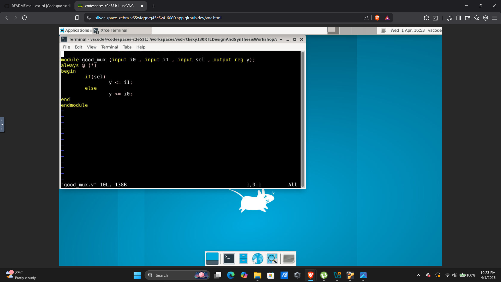
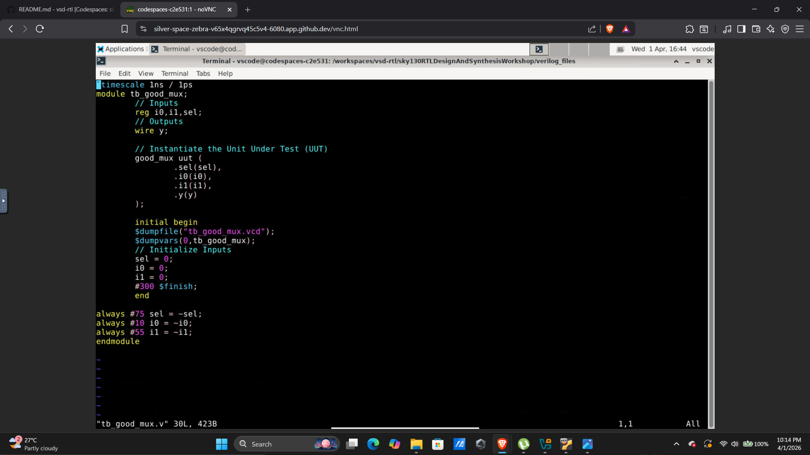
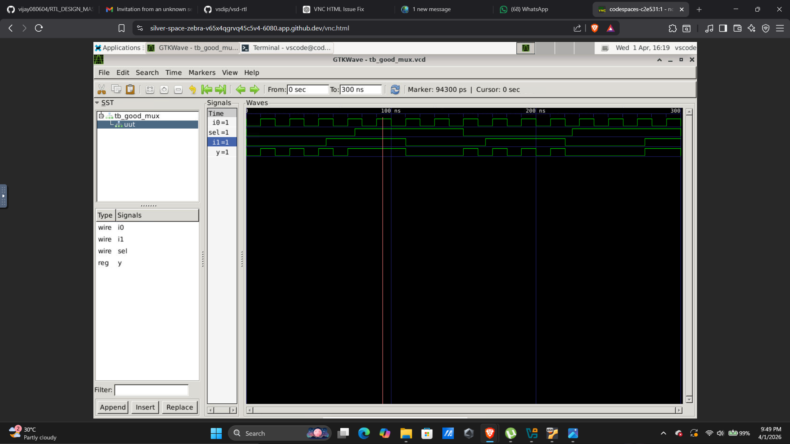
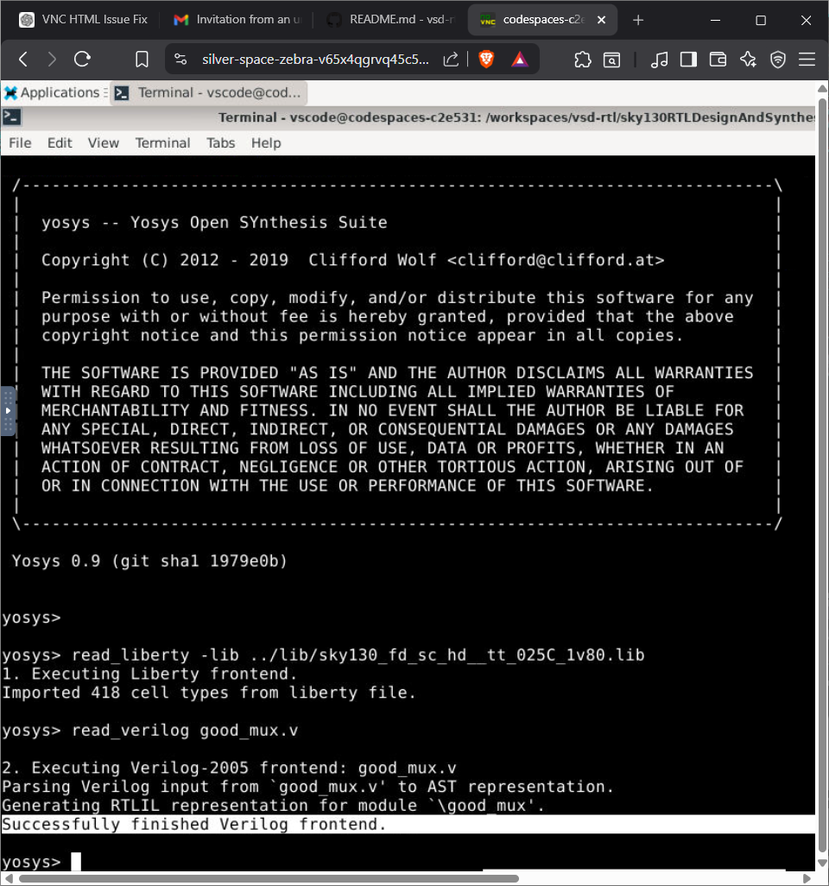
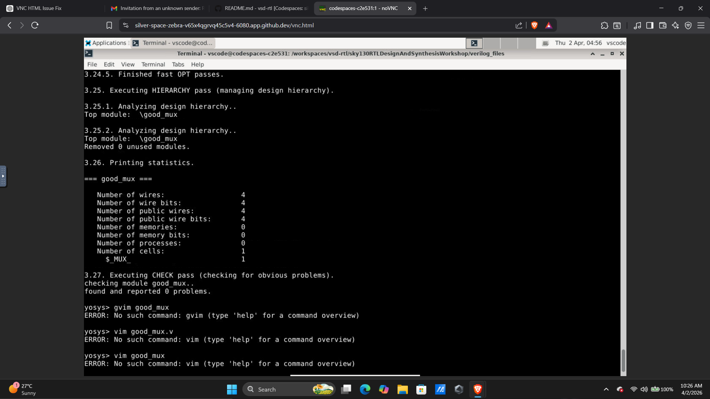
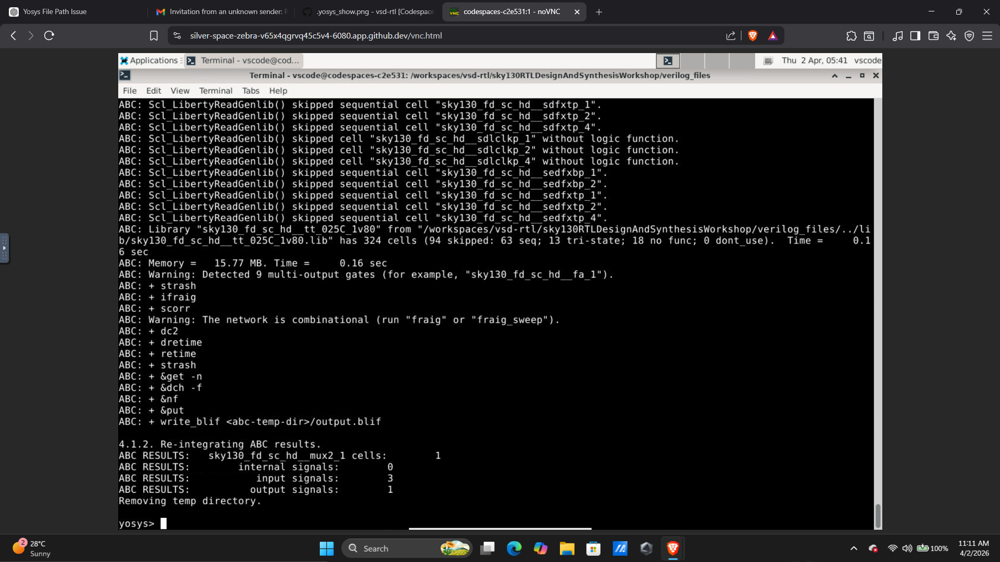
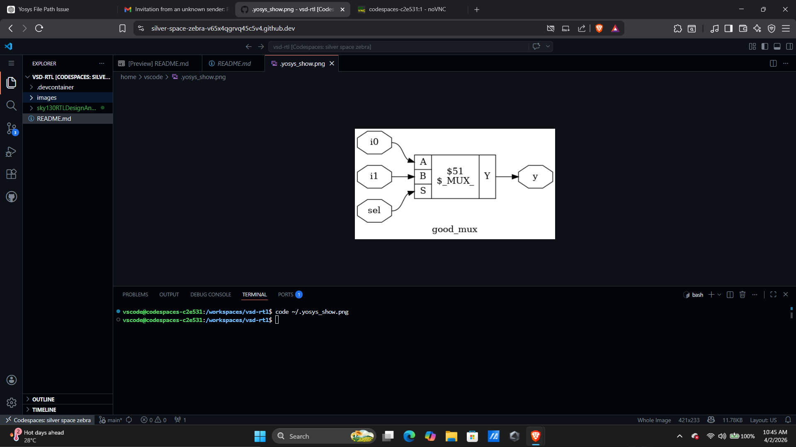
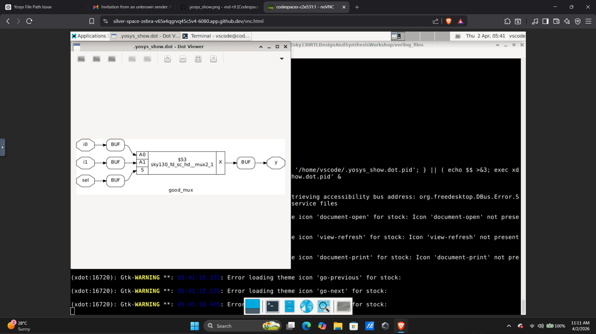

# 🚀 Day 1: RTL Design Flow (In Progress)

## 🎯 Objective

The goal of Day 1 is to understand and practically implement the **RTL Design Flow**, which includes:

* Writing Verilog code
* Verifying functionality using simulation
* Observing signal behavior using waveforms
* Converting RTL into gate-level representation using synthesis

---

## 🧠 Introduction to RTL Design

RTL (Register Transfer Level) is a way of describing digital circuits using a hardware description language like Verilog.

Instead of directly building hardware, engineers follow a structured flow:

1. **Design** → Write Verilog code
2. **Verify** → Check logic using simulation
3. **Analyze** → Observe waveform behavior
4. **Synthesize** → Convert into gates (netlist)

👉 This complete process is called the **RTL design flow**.

---

## ⚙️ Tools Used

| Tool              | Purpose                             |
| ----------------- | ----------------------------------- |
| GitHub Codespaces | Cloud-based development environment |
| Icarus Verilog    | Compilation and simulation          |
| GTKWave           | Waveform visualization              |
| Yosys             | RTL synthesis tool                  |

---

# 🔄 Complete Flow Implemented

---

## 🧩 Step 1: RTL Design (MUX)

We implemented a **2:1 Multiplexer (MUX)** using Verilog.

👉 A MUX selects one of the inputs based on a select signal.

### 📸 RTL Code



### 💡 Explanation

* `i0`, `i1` → Input signals
* `sel` → Selection signal
* `y` → Output

Working:

* If `sel = 0` → Output = `i0`
* If `sel = 1` → Output = `i1`

---

## 🧪 Step 2: Testbench Creation

A **testbench** is used to verify the functionality of the design.

### 📸 Testbench



### 💡 Explanation

* Applies different input combinations
* Uses `$dumpfile` and `$dumpvars`
* Generates waveform file (`.vcd`)

👉 This helps in checking whether the design behaves correctly.

---

## ▶️ Step 3: Simulation

Simulation is performed using Icarus Verilog.

```bash
iverilog good_mux.v tb_good_mux.v
./a.out
vvp a.out
```

### 💡 Explanation

* `iverilog` → Compiles the design
* `vvp` → Executes simulation
* Generates `.vcd` file

👉 This step ensures logic correctness before moving to hardware.

---

## 📊 Step 4: Waveform Analysis

The waveform is viewed using GTKWave.

### 📸 Waveform Output



### 💡 Explanation

* Displays signal transitions over time
* Helps verify correct behavior
* Useful for debugging

👉 Confirms that MUX output matches expected logic.

---

## 🔧 Step 5: Reading Design in Yosys

Now we move to synthesis using Yosys.

```bash
yosys
```

Inside Yosys:

```tcl
read_liberty -lib ../lib/sky130_fd_sc_hd__tt_025C_1v80.lib
read_verilog good_mux.v
```

### 📸 Yosys Read



### 💡 Explanation

* Loads standard cell library
* Reads Verilog design
* Prepares synthesis environment

---

## 📈 Step 6: Design Statistics

Yosys provides statistics about the design.

### 📸 Yosys Stats



### 💡 Explanation

* Displays number of wires, cells, etc.
* Confirms successful parsing of design

---

## ⚙️ Step 7: Synthesis & Technology Mapping

The RTL is converted into gate-level logic.

```tcl
synth
abc
```

### 📸 Synthesis Output



### 💡 Explanation

* Maps RTL to standard cells
* Uses optimization techniques
* Prepares final gate-level design

---

## 🔗 Step 8: Netlist Generation

After synthesis, we get a **netlist**.

👉 Netlist = list of gates + connections

### 📸 Netlist



### 💡 Explanation

* Represents actual hardware structure
* Shows how components are connected

---

## 🧩 Step 9: Netlist Visualization

We can visualize the generated circuit.

### 📸 Netlist View



### 💡 Explanation

* Graphical representation of design
* Easier to understand circuit connections

---

# 🎯 Key Takeaways

* Simulation is critical before synthesis
* RTL describes behavior, not physical hardware
* Synthesis converts logic into real gates
* Netlist represents actual circuit implementation
* Hands-on practice improves understanding significantly
