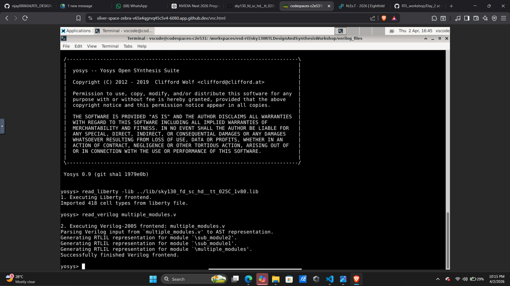
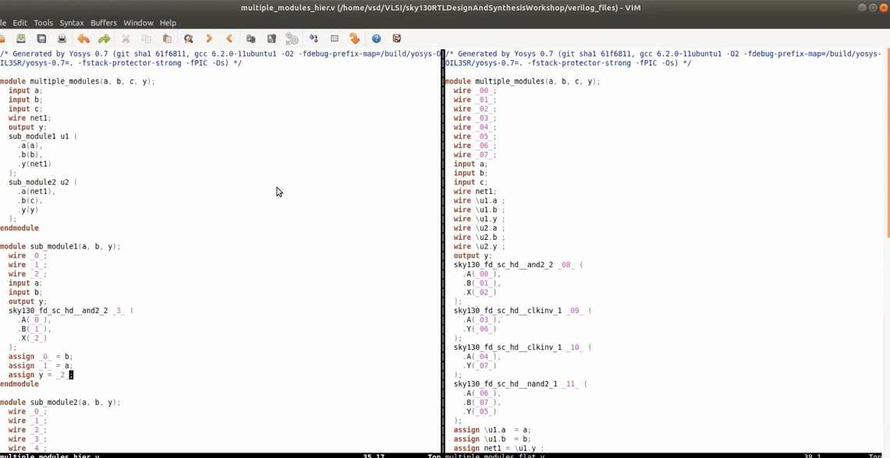
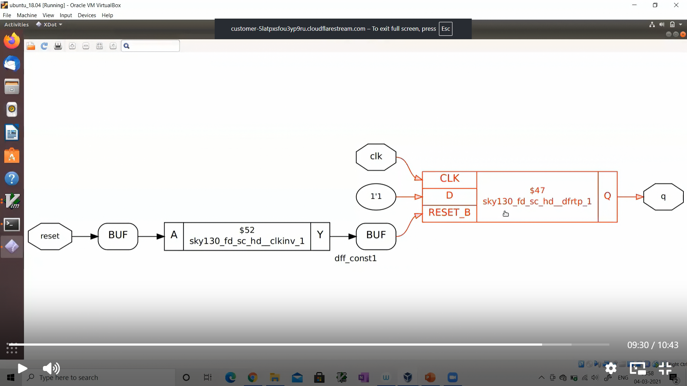
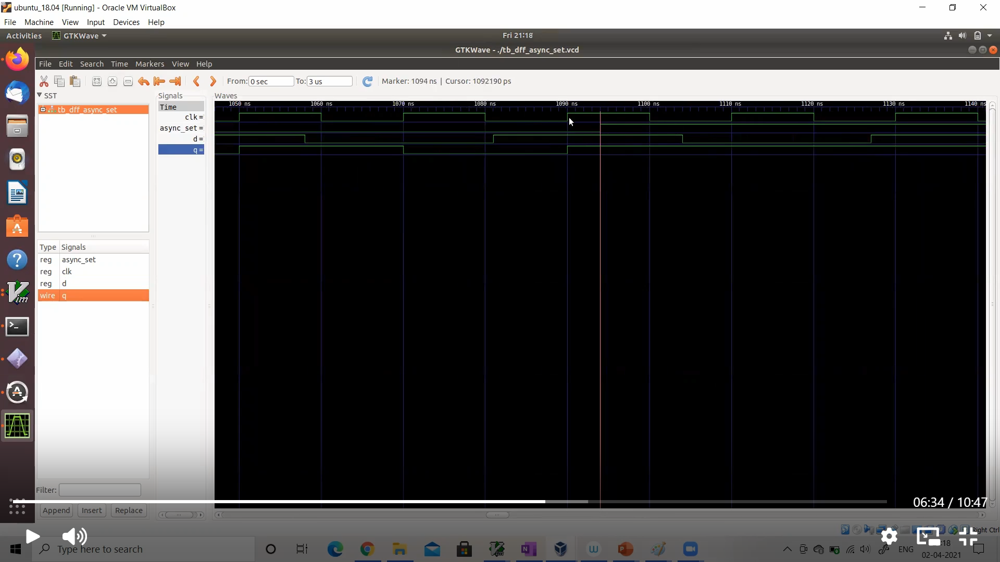

# 🚀 Day 2 – RTL Design & Synthesis (Detailed Notes)

---

## 🔹 1. Hierarchical Design (Multiple Modules)

Instead of writing everything in one module, we divide the design into **submodules**.

### 📌 Why?

* Improves readability
* Reusable design
* Easier debugging
* Industry standard practice

---

### 🧩 Example Structure

```
Top Module
 ├── Submodule 1 (AND)
 └── Submodule 2 (OR)
```

---

### 💻 Verilog Implementation

```verilog
module sub_module(input a, input b, output y);
    assign y = a | b;
endmodule

module sub_module1(input a, input b, output y);
    assign y = a & b;
endmodule

module multiple_module(input a, input b, input c, output y);

    wire net1;

    sub_module1 u1 (.a(a), .b(b), .y(net1));
    sub_module  u2 (.a(net1), .b(c), .y(y));

endmodule
```

---

## 🔹 2. Hardware Understanding from Notes (Bit Expansion & Wiring)

### 📌 Concept

From my handwritten notes:

* Operations like `y = 2 × a` are not simple arithmetic in hardware
* They are implemented using:

  * Bit shifting
  * Wire connections
  * Structural mapping

---

### 📸 Concept Visualization

*(From my notes – understanding hardware mapping)*

👉 Refer to handwritten diagrams showing:

* Bit expansion
* Signal propagation
* Output bit formation

---

### 🧠 Insight

* Hardware = **connections + gates**, not equations
* Every bit is physically mapped
* Output width depends on operation

---

## 🔹 3. Synthesis Flow (Yosys)

### 🛠 Steps Used

```bash
vim multiple_module.v
yosys

read_liberty -lib ../lib/sky130_fd_sc_hd__tt_025C_1v80.lib
read_verilog multiple_module.v

synth -top multiple_module
abc -liberty ../lib/sky130_fd_sc_hd__tt_025C_1v80.lib

show
```

---

### 📸 Yosys – Read Design



---

### 🧠 Internal Steps in Synthesis

* Elaboration
* Optimization
* Technology Mapping
* Constant Propagation
* Dead Code Removal

---

## 🔹 4. RTL vs Netlist

### 📌 Key Idea

* RTL → Behavioral
* Netlist → Structural

---

### 📸 RTL vs Netlist



---

## 🔹 5. Flattening the Design

### 📌 Why Flatten?

* Removes hierarchy
* Converts into single-level design

---

### 🔧 Command

```bash
flatten
write_verilog multiple_module_flat.v
```

---

### 🧠 Insight

* Hierarchy → human-friendly
* Flattened → tool-friendly

---

## 🔹 6. Standard Cell Library

👉 **sky130_fd_sc_hd**

---

### 📌 Key Points

* Each cell has:

  * Area
  * Power
  * Delay

---

### ⚠️ Trade-offs

| Parameter | Small Cell | Large Cell |
| --------- | ---------- | ---------- |
| Area      | Low        | High       |
| Speed     | Slow       | Fast       |
| Power     | Low        | High       |

---

### 🧠 Extra Insight

* Synthesis chooses cells based on:

  * Timing
  * Area
  * Power

---

## 🔹 7. Why PMOS is Wider?

* PMOS mobility < NMOS mobility
* PMOS is made wider to balance current

👉 Ensures:

* Equal rise/fall delay
* Better switching

---

## 🔹 8. Sequential Logic – D Flip-Flop

### 📌 Why Flops?

* Remove glitches
* Store values
* Synchronize with clock

---

### 💻 Code

```verilog
module dff_const(input clk, input reset, output reg q);

always @(posedge clk or posedge reset)
begin
    if (reset)
        q <= 1'b0;
    else
        q <= 1'b1;
end

endmodule
```

---

### 📸 DFF Mapping



---

### 🧠 Insight

* Flip-flops are mapped to real standard cells
* Example:

  * `sky130_fd_sc_hd__dfxtp`

---

## 🔹 9. Asynchronous vs Synchronous Reset

### 🟢 Asynchronous

```verilog
always @(posedge clk or posedge async_reset)
```

* Immediate reset
* No clock dependency

---

### 🔵 Synchronous

```verilog
always @(posedge clk)
```

* Happens on clock edge

---

### 🧠 Interview Insight

| Type  | Advantage | Disadvantage |
| ----- | --------- | ------------ |
| Async | Fast      | Risky        |
| Sync  | Stable    | Slight delay |

---

## 🔹 10. Simulation Flow

```bash
iverilog dff_const.v tb_dff_const.v
./a.out
gtkwave tb_dff_const.vcd
```

---

### 📸 Waveform



---

### 🧠 Insight

* Verifies correctness
* Ensures design works as expected

---

## 🔹 11. Sequential Synthesis Step

```bash
dfflibmap -liberty ../lib/sky130_fd_sc_hd__tt_025C_1v80.lib
```

---

### 🧠 Why Needed?

* `abc` → combinational logic
* `dfflibmap` → sequential logic

---

## 🔹 12. Netlist Visualization


---

### 🧠 Insight

* Final hardware structure
* Shows real connections

---

## 🔹 13. Important Insights 💡

* RTL is abstract → Netlist is physical
* Hardware is built using gates, not equations
* Synthesis optimizes automatically
* Modular design is scalable

---

## 🔹 14. Common Mistakes

* Forgetting top module
* Not loading library
* Skipping waveform verification

---

## 📊 Summary

| Topic                | Status |
| -------------------- | ------ |
| Multiple Modules     | ✅      |
| Yosys Flow           | ✅      |
| Flattening           | ✅      |
| Standard Cells       | ✅      |
| Flip-Flops           | ✅      |
| Sequential Synthesis | ✅      |

---

## 🚀 Final Takeaway

* RTL → Abstract design
* Synthesis → Converts to hardware
* Mapping → Uses standard cells
* Simulation → Validates design

---

🔥 **Day 2 complete – Strong RTL → Gate-Level understanding**
