# DAY 2 – Timing Libraries, PVT and Multi-Module Synthesis

---

## 1. Timing Libraries (.lib)

### Explanation  
A timing library (.lib) is a technology-specific file that contains detailed electrical and timing characterization of standard cells. These libraries are generated after silicon characterization and are used by synthesis and timing tools to map RTL into real hardware.

Each cell in the library contains:

- Propagation delay information for different input/output conditions  
- Transition (slew) data  
- Power consumption (dynamic and leakage)  
- Input capacitance and output load constraints  
- Setup and hold timing constraints for sequential elements  

The delay values are stored as lookup tables dependent on:

- Input transition  
- Output load capacitance  
- Process, voltage, and temperature  

This makes the synthesis process timing-aware rather than purely logic-based.

---

### Significance

- Enables realistic hardware mapping  
- Ensures timing-aware synthesis  
- Allows accurate delay and power estimation  
- Forms the foundation for Static Timing Analysis  

---

## 2. SKY130 Library Explanation

Example:
```
sky130_fd_sc_hd__tt_025C_1v80.lib
```

### Breakdown

- sky130 → 130nm technology  
- fd → Foundry design  
- sc → Standard cell  
- hd → High density  
- tt → Typical process  
- 025C → 25°C  
- 1v80 → 1.8V  

---

### Library View

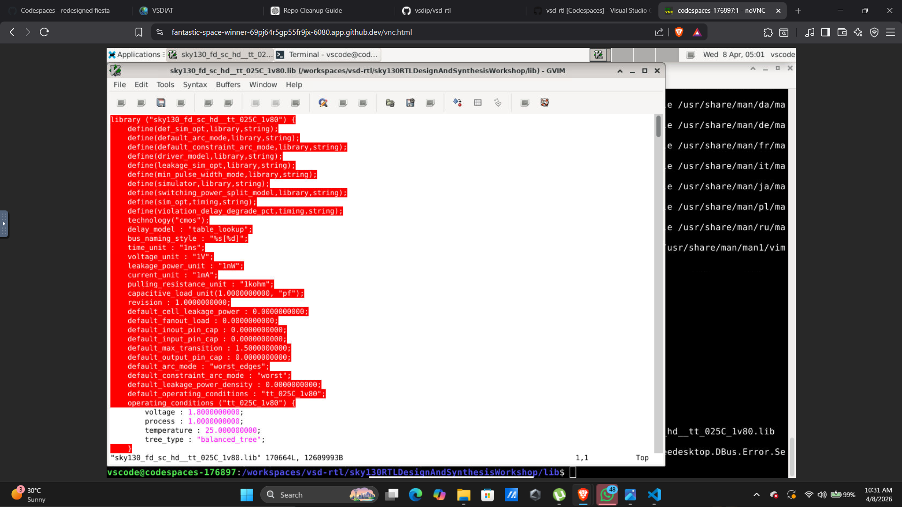

---

### Engineering Insight

Different library files represent different operating conditions. Changing the library directly affects delay, power, and mapping decisions. The same RTL can produce different gate-level implementations depending on the selected library.

---

## 3. PVT (Process, Voltage, Temperature)

### Explanation

PVT represents real-world variations that influence circuit behavior after fabrication.

- Process variations determine speed  
- Voltage variations affect delay and power  
- Temperature variations impact performance  

---

### Worst Case Condition

Slow process, low voltage, high temperature  

---

## 4. Delay, Power, Capacitance and Leakage

### Delay

Propagation delay is the time taken for a change in input to affect the output.

---

### Power

Dynamic power:
```
P = α × C × V² × f
```

Leakage power:
Power consumed even in idle state  

---

### Capacitance

Higher capacitance results in slower transitions and increased delay.

---

## 5. Comparison of Same Modules

Different RTL implementations of the same functionality can result in different performance due to variations in logic depth, gate count, and load distribution.

---

## 6. Stacked PMOS

Stacked PMOS transistors increase resistance and reduce current flow, leading to slower switching and higher delay.

---

## 7. Divide and Conquer

Large designs are divided into smaller modules to improve modularity, readability, and synthesis efficiency.

---

# LAB SECTION

---

## Objective

The objective of this lab is to design, synthesize, and verify RTL modules using the SKY130 standard cell library. The goal is to understand how Verilog descriptions are converted into hardware and how different design styles influence the final implementation.

---

## 1. Multiple Modules Design

### Code

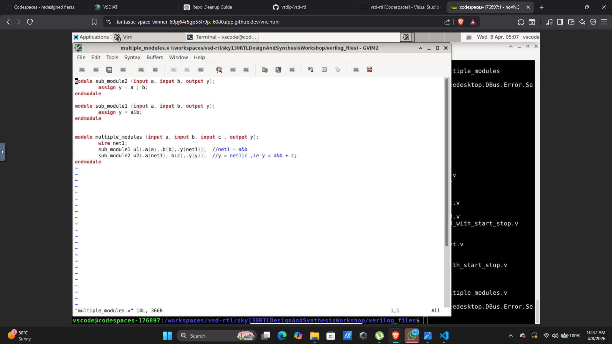

---

### Explanation

This design demonstrates hierarchical modeling using two submodules integrated into a top module.

The first submodule performs an AND operation between inputs a and b. The second submodule performs an OR operation. The top module connects these submodules through an intermediate signal.

---

### Functional Flow

```
y = (a & b) | c
```

---

### Synthesis Output

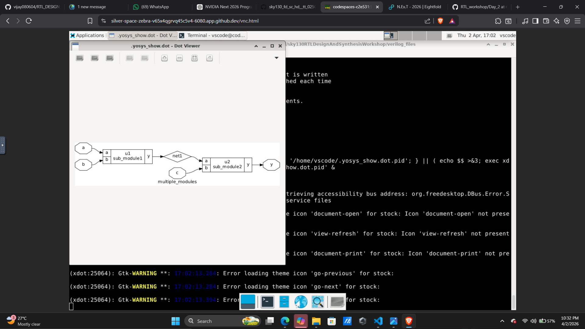

---

### Flattened Netlist

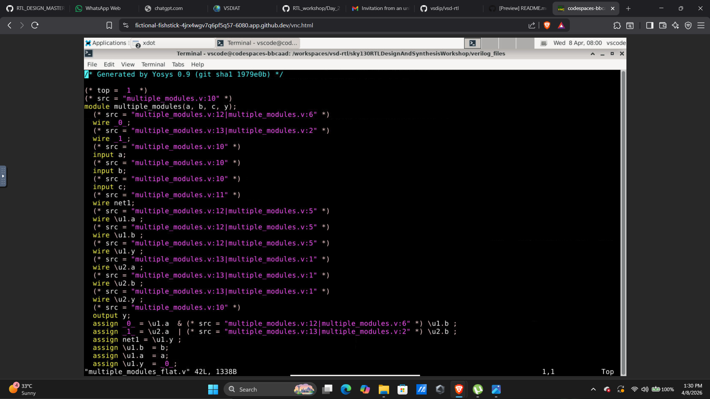

---

### Statistics

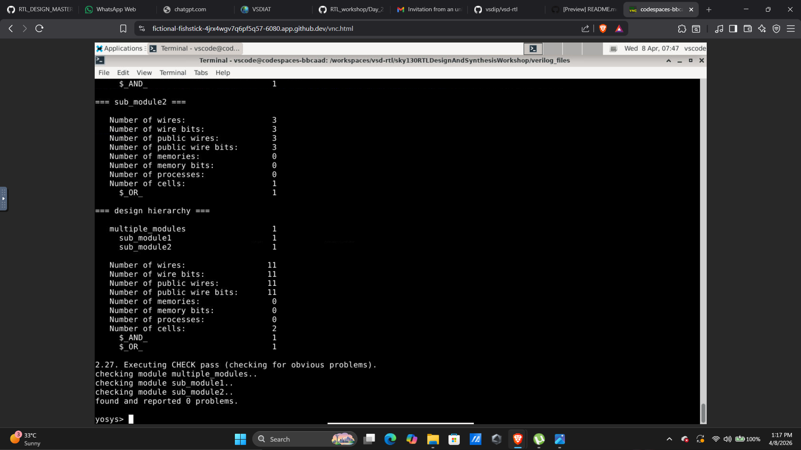

---

### Submodule View

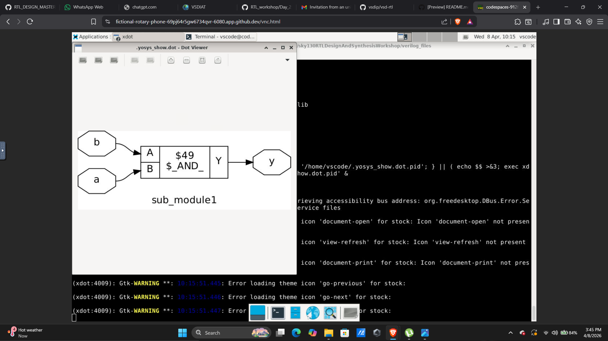

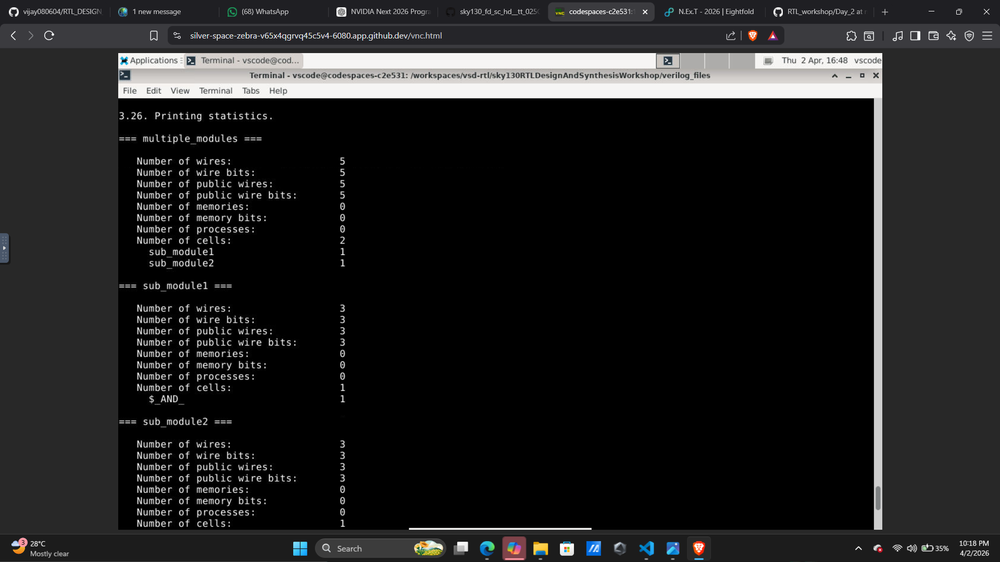

---

### Observations

The hierarchical structure is preserved initially, making the design easy to understand and debug. After flattening, all modules merge into one level, enabling better optimization. The netlist confirms correct mapping into AND and OR gates.

---

## 2. D Flip-Flop with Asynchronous Reset

### Code

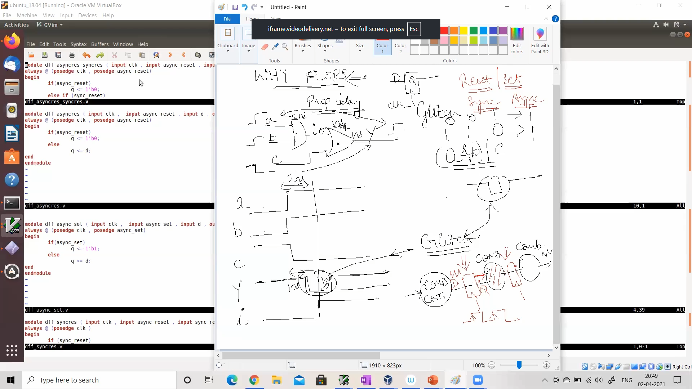

---

### Explanation

The reset acts independently of the clock. When reset is asserted, output is immediately forced to zero.

---

### Synthesis Output


---

### Simulation Output

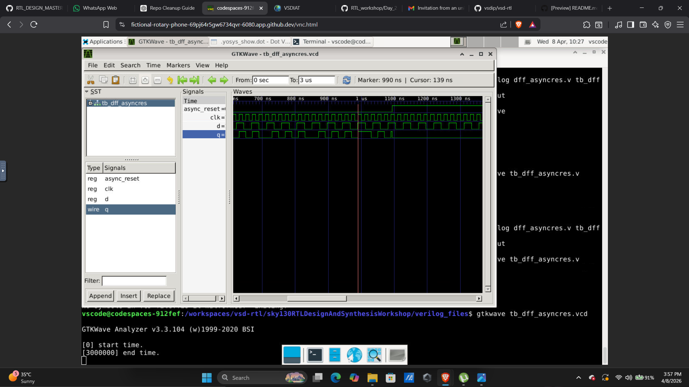

---

### Observations

Output changes instantly when reset is applied. The design maps to a flip-flop with a reset pin.

---

## 3. D Flip-Flop with Asynchronous Set

### Code

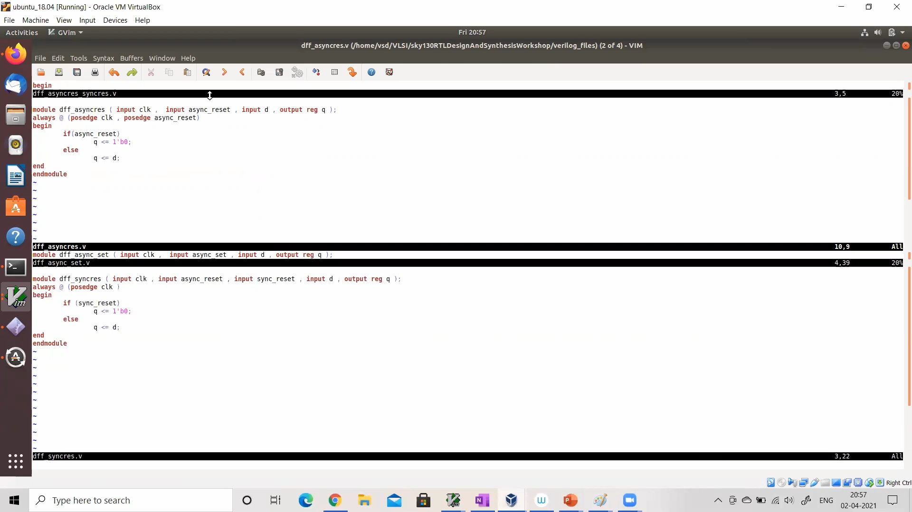

---

### Explanation

The set signal forces the output to logic high immediately, regardless of clock.

---

### Synthesis Output

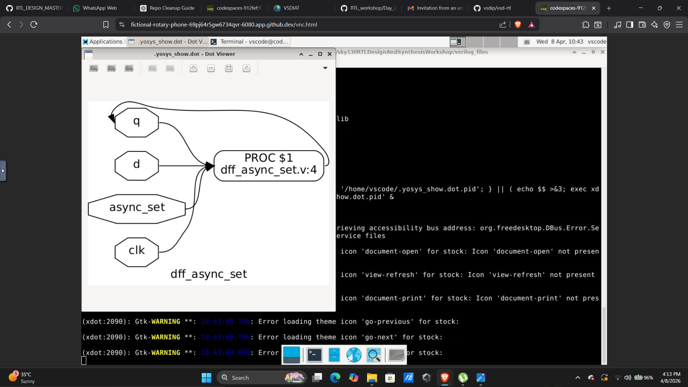

---

### Simulation Output

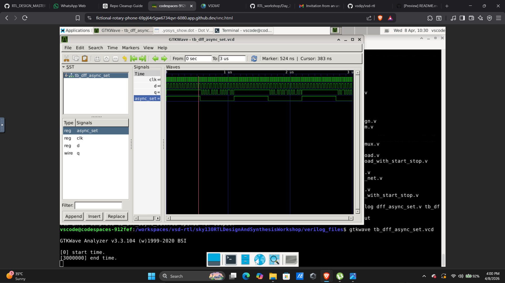

---

### Observations

Output becomes high immediately when set is active. The design maps correctly to a flip-flop with set functionality.

---

## 4. D Flip-Flop with Synchronous Reset

### Synthesis Output

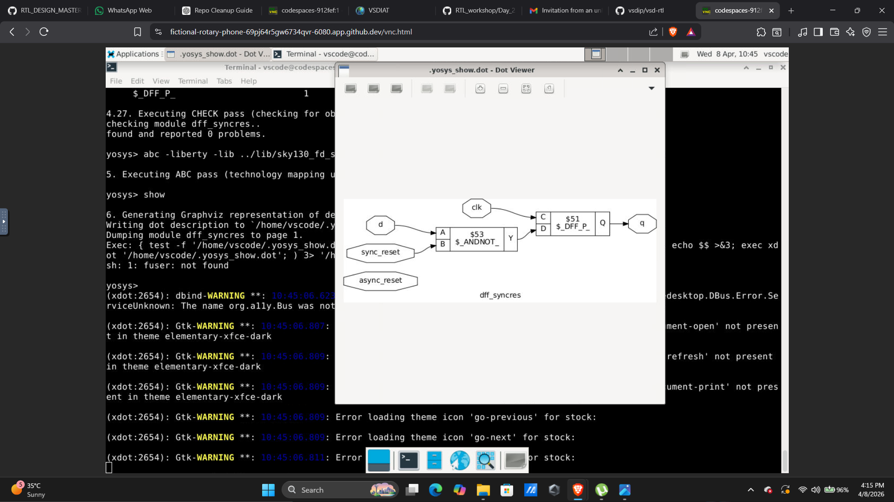

---

### Explanation

Reset is applied only at the clock edge.

---

### Observations

Reset occurs synchronously, making the design stable and predictable.

---

## 5. Multiply by 2

### Code

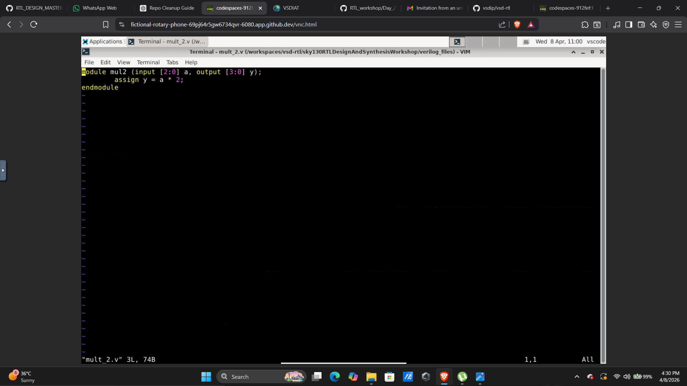

---

### Explanation

Implemented using left shift operation.

---

### Synthesis Output

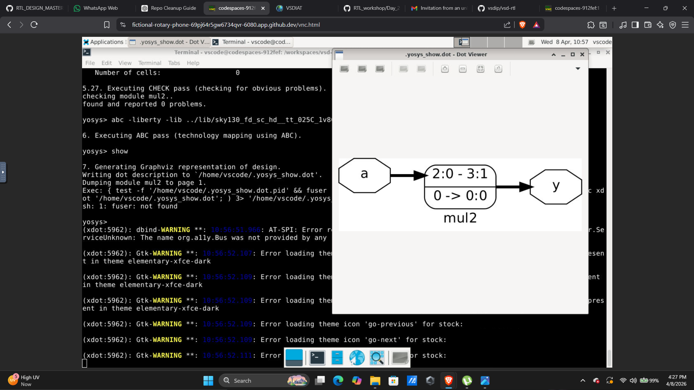

---

### Observations

Implemented using wiring instead of arithmetic hardware.

---

## 6. Multiply by 8

### Code

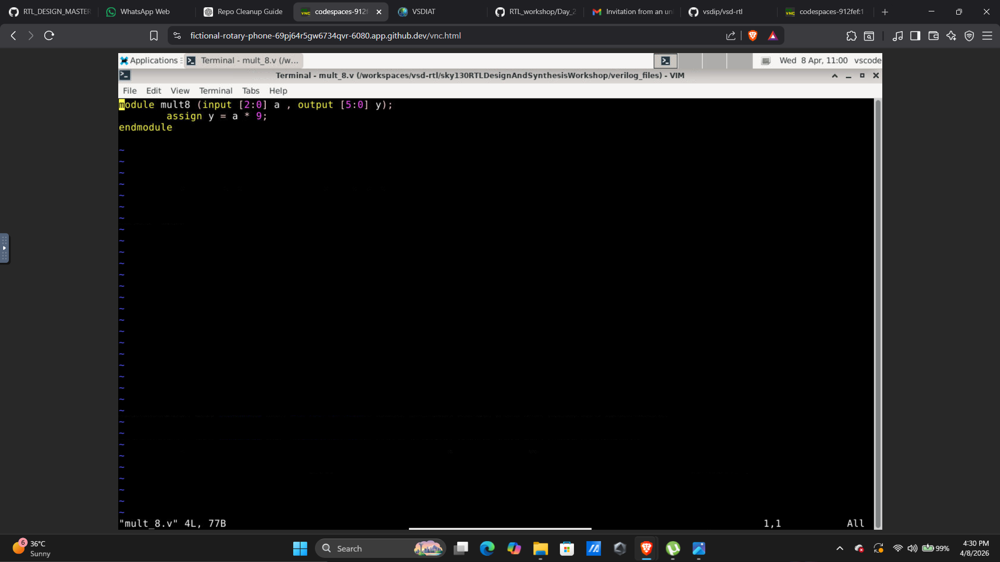

---

### Explanation

Implemented using left shift by 3 bits.

---

### Synthesis Output

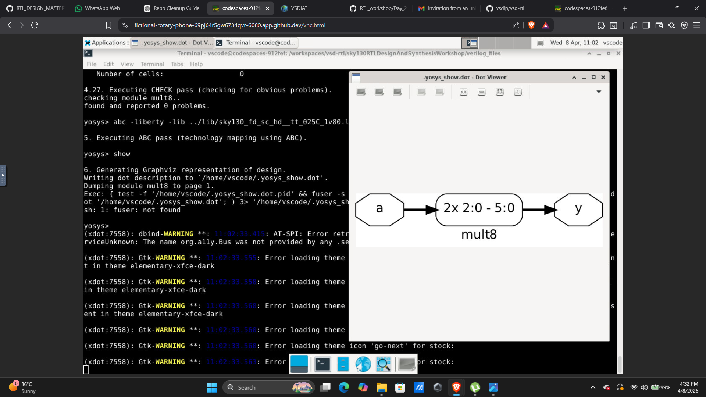

---

### Observations

Efficient implementation without multipliers.

---

## 7. Flattened Design

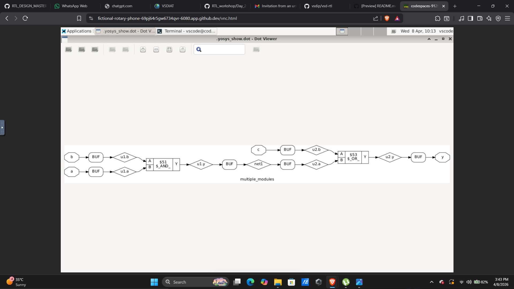

---

### Explanation

Flattening removes hierarchy and combines all logic.

---

### Observations

Improves optimization but reduces readability.

---

## Commands Used

### Synthesis

```
read_liberty -lib ../lib/sky130_fd_sc_hd__tt_025C_1v80.lib
read_verilog multiple_modules.v
synth -top multiple_modules
dfflibmap -liberty ../lib/sky130_fd_sc_hd__tt_025C_1v80.lib
abc -liberty ../lib/sky130_fd_sc_hd__tt_025C_1v80.lib
clean
write_verilog multiple_modules_net.v
```

---

### Gate Level Simulation

```
iverilog my_lib/verilog_model/primitives.v 
my_lib/verilog_model/sky130_fd_sc_hd.v 
verilog_files/multiple_modules_net.v 
verilog_files/multiple_modules_tb.v

./a.out
gtkwave multiple_modules.vcd
```

---

## Flow of Execution

RTL → Yosys → Library Mapping → Optimization → Netlist → Simulation → Verification  

---

## Key Takeaways

- Timing libraries are essential  
- PVT affects performance  
- Hierarchical design improves scalability  
- GLS ensures correctness  

---

## Conclusion

This day builds a strong understanding of timing-aware RTL design and its transformation into real hardware using synthesis and simulation.