# 📘 Day 3 – Logic Optimization in RTL Design

## 🚀 Overview
Day 3 focuses on **logic optimization techniques** in digital design using Yosys.

The main goal is:
- Reduce unnecessary hardware  
- Improve performance  
- Optimize area and power  

We explored both:
- ✅ Combinational Optimization  
- ✅ Sequential Optimization  

---

# 📚 Topics Covered

---

## 🔹 1. Combinational Logic Optimization

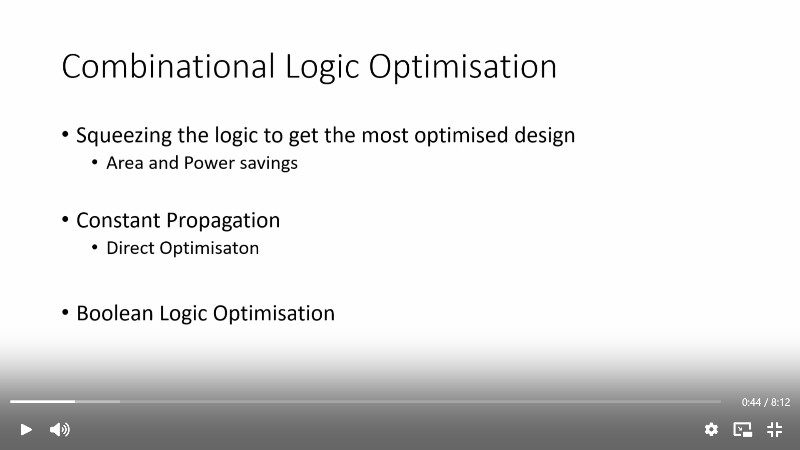

### 💡 Concept:
Optimization means **reducing logic complexity without changing functionality**

### 🔍 Key Benefits:
- Less hardware (area reduction)
- Faster circuits
- Lower power consumption

---

## 🔹 2. Constant Propagation

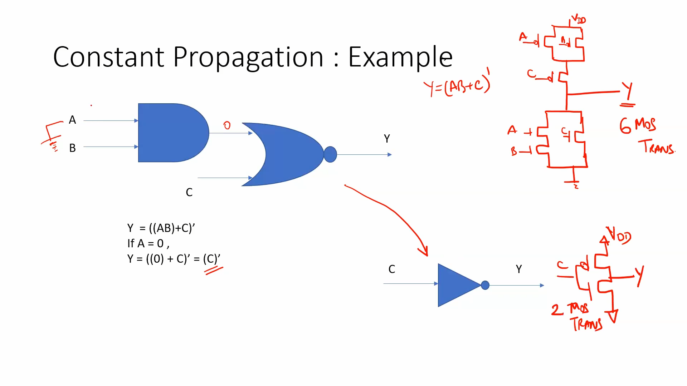

### 💡 Concept:
If any signal is constant (0 or 1), synthesis simplifies the logic.

### 🔍 Example:
```
Y = (A.B + C)'
If A = 0 → Y = (0 + C)' = C'
```

👉 AND gate removed → only inverter remains

### 🔥 Insight:
- Reduces transistor count  
- Simplifies circuit drastically  

---

## 🔹 3. Boolean Logic Optimization

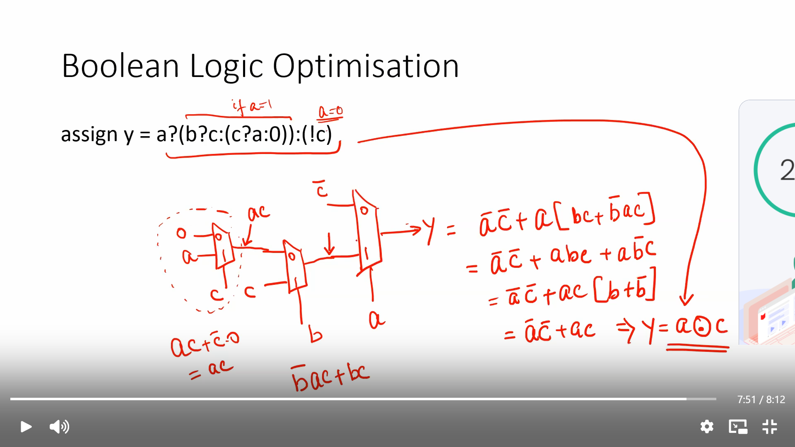

### 💡 Concept:
Using Boolean algebra to simplify complex logic expressions

### 🔍 Example:
```
y = a ? (b ? c : (c ? a : 0)) : (!c)
```

👉 After simplification:
```
y = a ⊕ c
```

### 🔥 Insight:
- Complex mux logic → XOR gate  
- Faster + smaller design  

---

## 🔹 4. Advanced Optimization Techniques

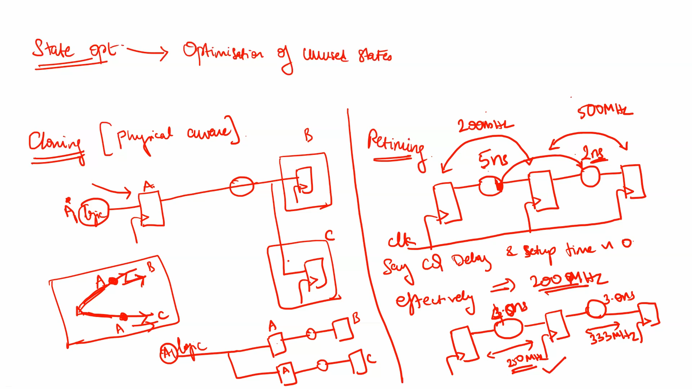

### 💡 Includes:
- **State Optimization** → Remove unused states  
- **Cloning** → Duplicate logic to improve timing  
- **Retiming** → Move flip-flops to balance delays  

---

# ⚙️ Standard Synthesis Flow

```tcl
read_liberty -lib lib/sky130_fd_sc_hd__tt_025C_1v80.lib
read_verilog verilog_files/<file>.v
synth -top <module_name>
dfflibmap -liberty lib/sky130_fd_sc_hd__tt_025C_1v80.lib
abc -liberty lib/sky130_fd_sc_hd__tt_025C_1v80.lib
opt_clean -purge
show
```

---

# 🧪 LABS

---

## 🔬 Lab 1 – opt_check

### Code:
```verilog
assign y = a ? b : 0;
```

### 🔍 Optimization:
```
y = a & b
```

### 📸 Output:
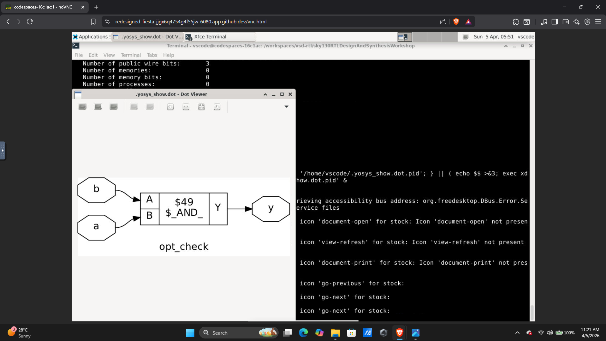

### 💡 Insight:
- MUX simplified to AND gate  
- Constant 0 removed logic  

---

## 🔬 Lab 2 – opt_check2

### Code:
```verilog
assign y = a ? 1 : b;
```

### 🔍 Optimization:
```
y = a | b
```

### 📸 Output:


### 💡 Insight:
- MUX simplified to OR gate  

---

## 🔬 Lab 3 – opt_check3

### 📸 Output:
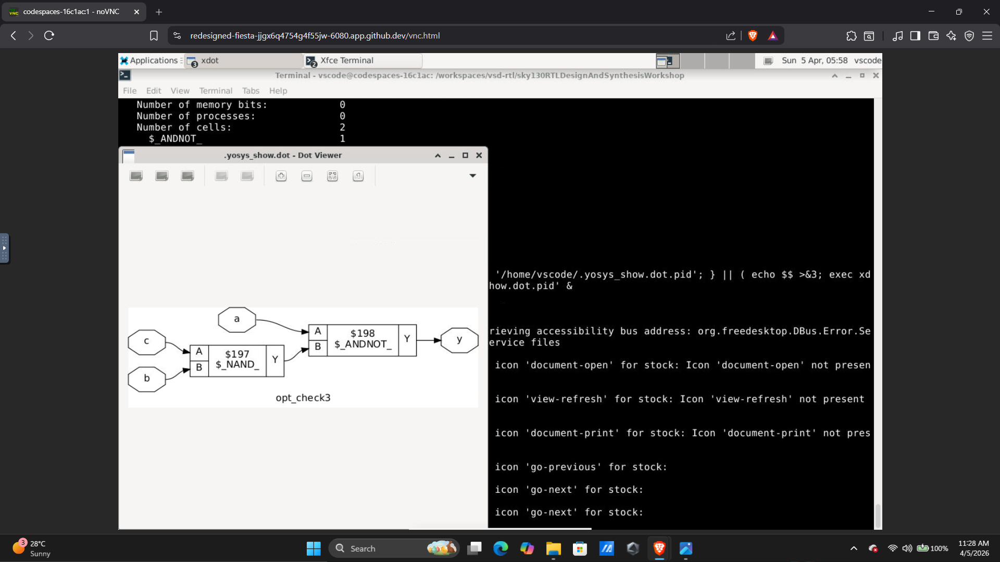

### 💡 Insight:
- Complex logic simplified using Boolean optimization  

---

## 🔬 Lab 4 – Logic Simplification Notes

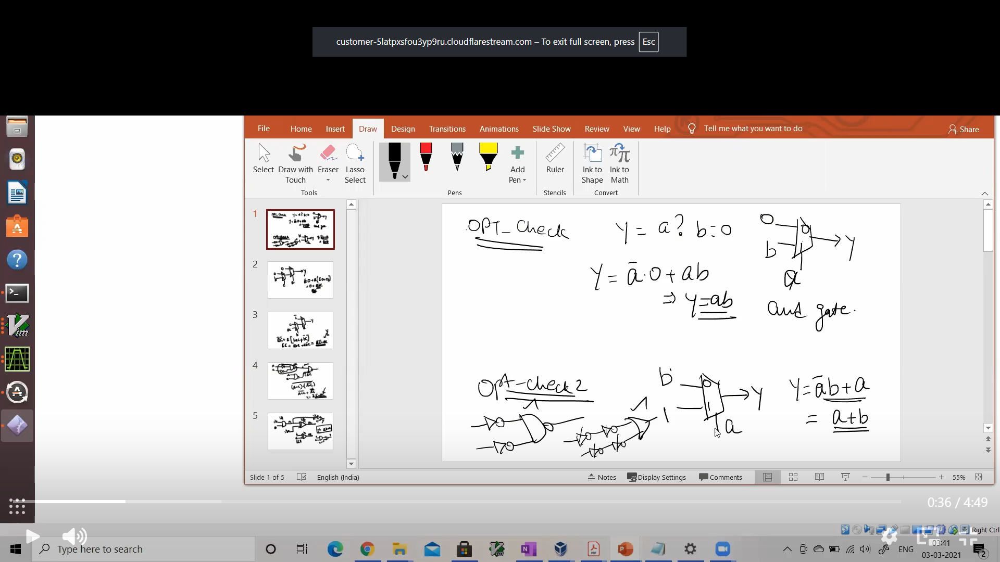

### 💡 Insight:
- Step-by-step Boolean reduction  
- Shows transformation from complex logic → simplified logic  

---

## 🔬 Lab 5 – dff_const1

### 📸 Synthesis:
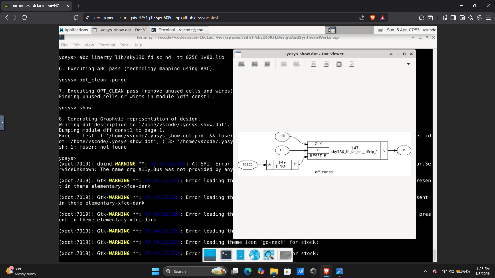

### 📸 Waveform:
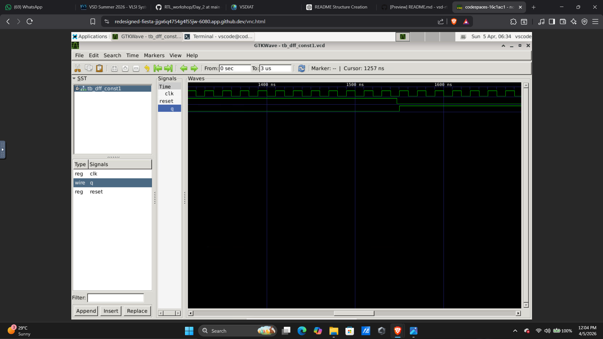

### 💡 Insight:
- Flip-flop partially optimized  
- Constant propagation applied  

---

## 🔬 Lab 6 – dff_const2

### 📸 Logic:
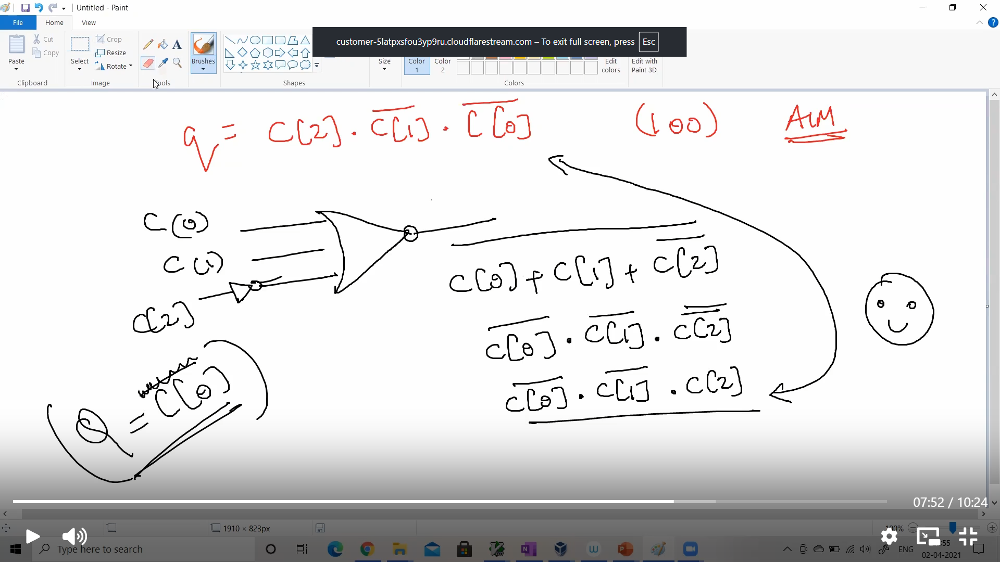

### 📸 Waveform:
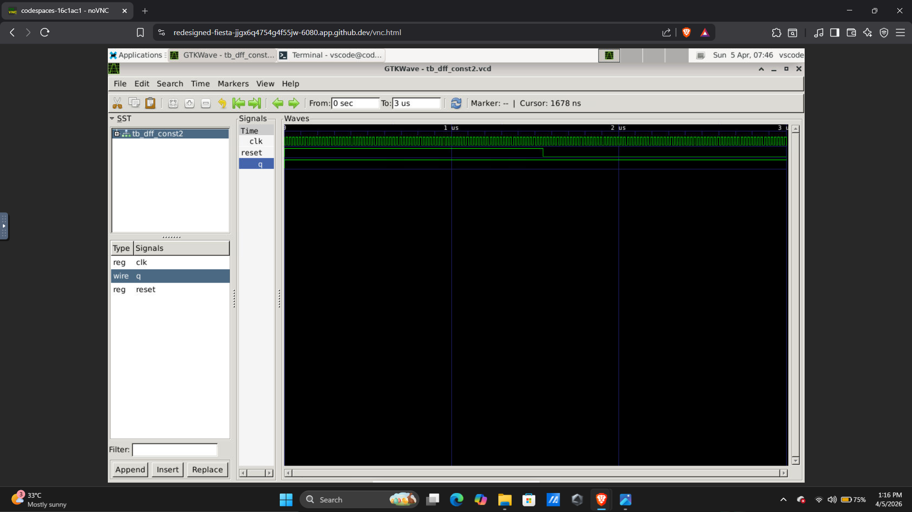

### 💡 Insight:
- Flip-flop completely removed  
- Output directly tied to constant  

---

## 🔬 Lab 7 – dff_const3

### 📸 Logic:
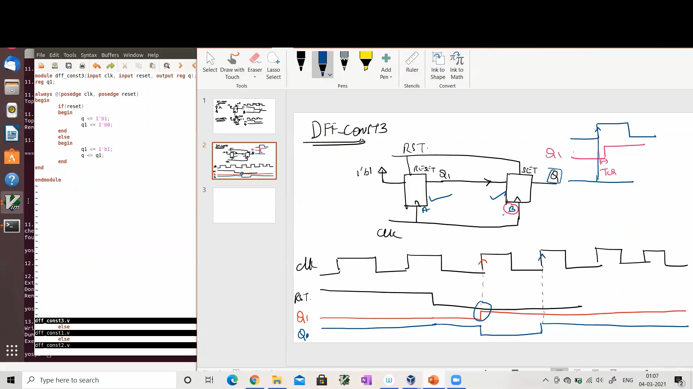

### 💡 Insight:
- Sequential optimization  
- Intermediate register behavior  

---

## 🔬 Counter Optimization

### 📸 Output:
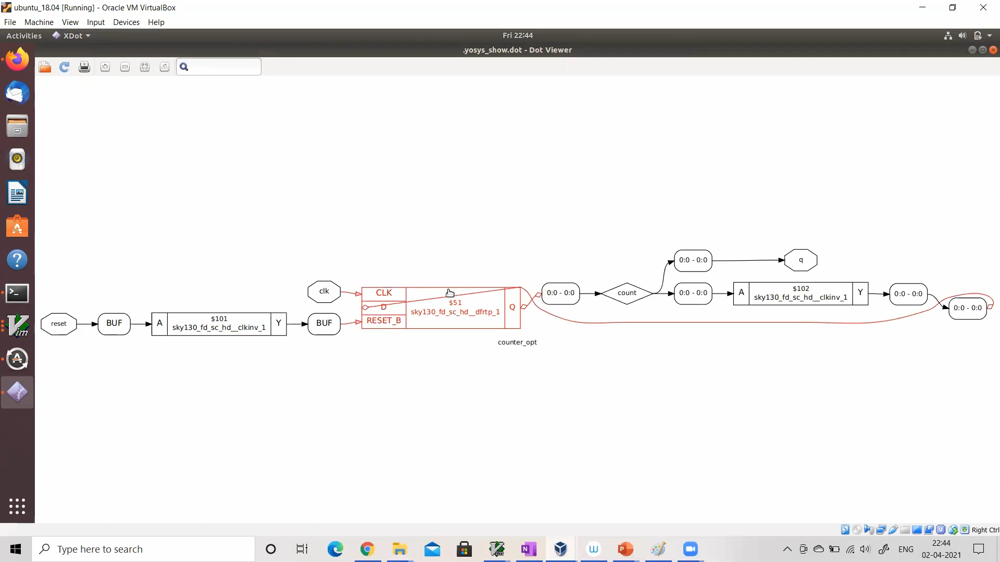

### 💡 Insight:
- Unused bits removed  
- Logic trimmed  

---

## 🔬 Counter Optimization 2

### 📸 Output:
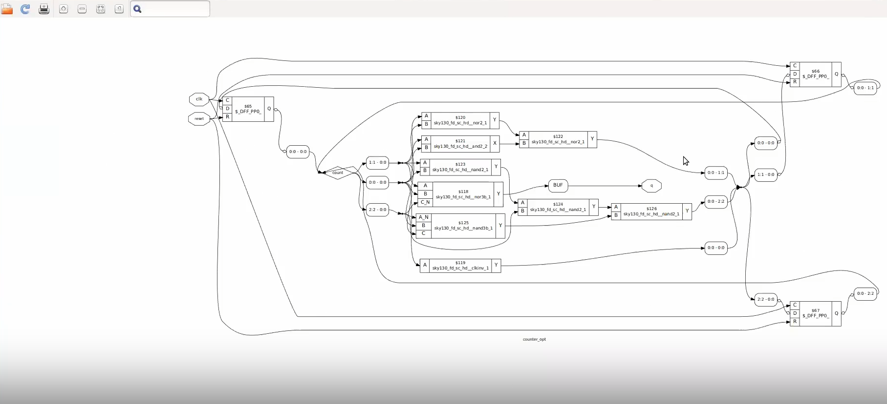

### 💡 Insight:
- Further optimization  
- Only required logic retained  

---

# 🧠 Key Learnings

### ✅ Constant Propagation
- Removes unnecessary logic  
- Simplifies circuits  

### ✅ Boolean Optimization
- Reduces expressions  
- Converts mux → simple gates  

### ✅ Sequential Optimization
- Flip-flops removed if constant  
- Registers optimized  

### ✅ Yosys Commands
- `opt_clean -purge` → removes unused logic  
- `abc` → technology mapping  
- `dfflibmap` → FF mapping  

---

# 🔥 Final Conclusion

👉 RTL code ≠ Final hardware  
👉 Synthesis tools optimize automatically  

### 🚀 Result:
- Smaller circuits  
- Faster performance  
- Efficient design  

---

# 💼 Resume Point

> Performed combinational and sequential logic optimization using Yosys, including constant propagation, Boolean simplification, and flip-flop optimization, improving hardware efficiency.