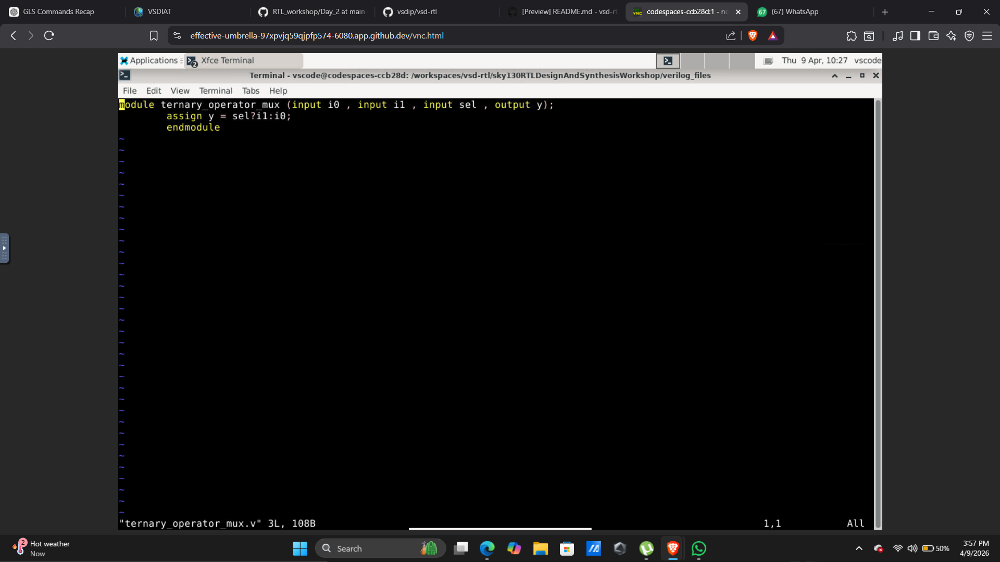
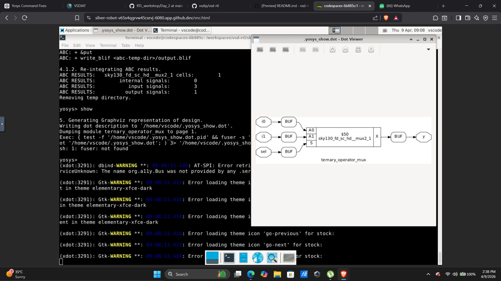
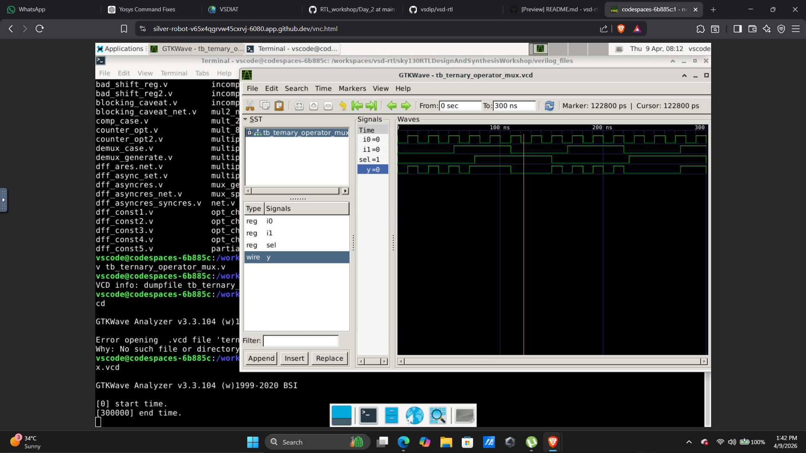
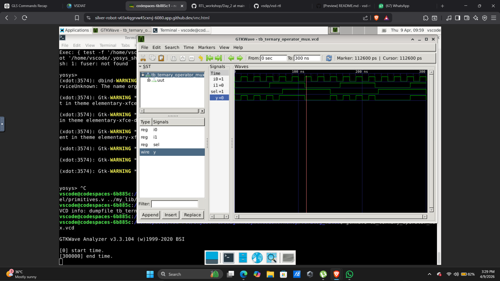
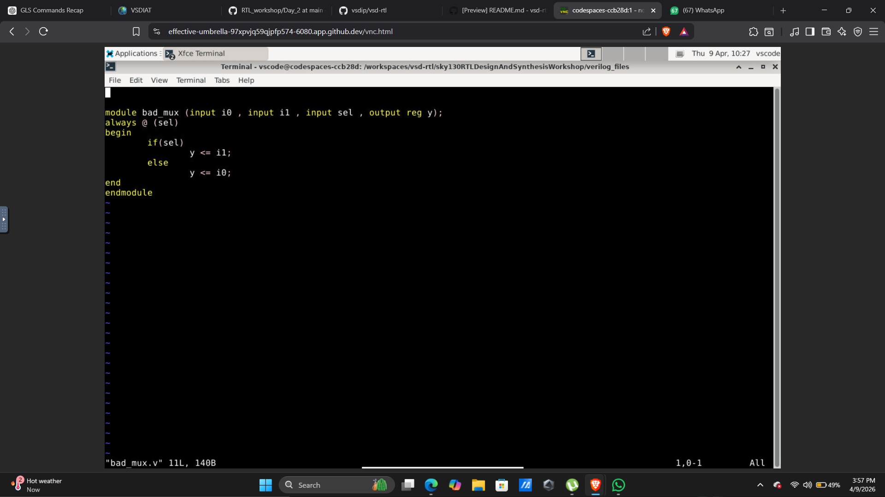
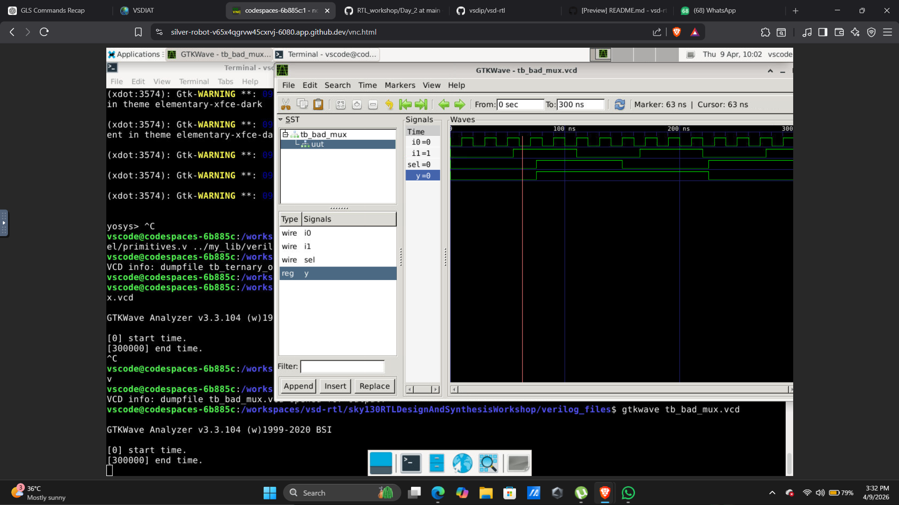
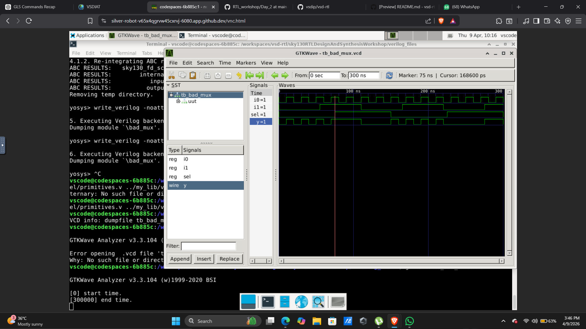
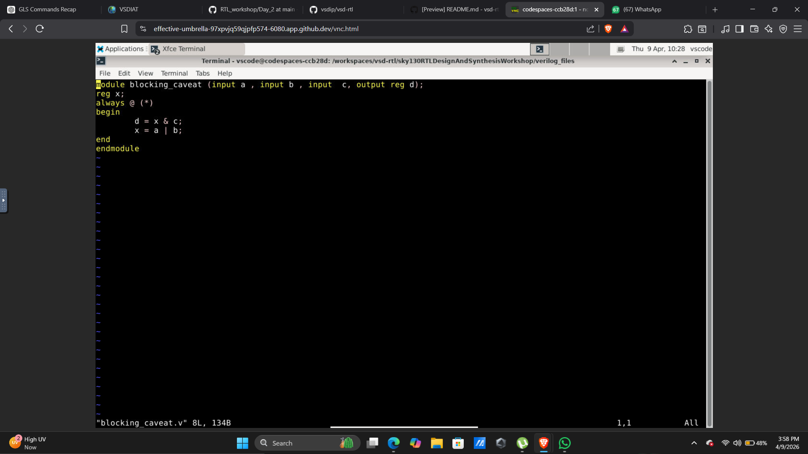
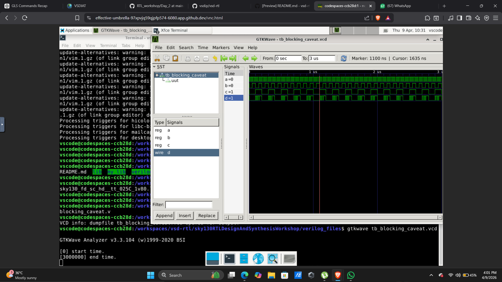
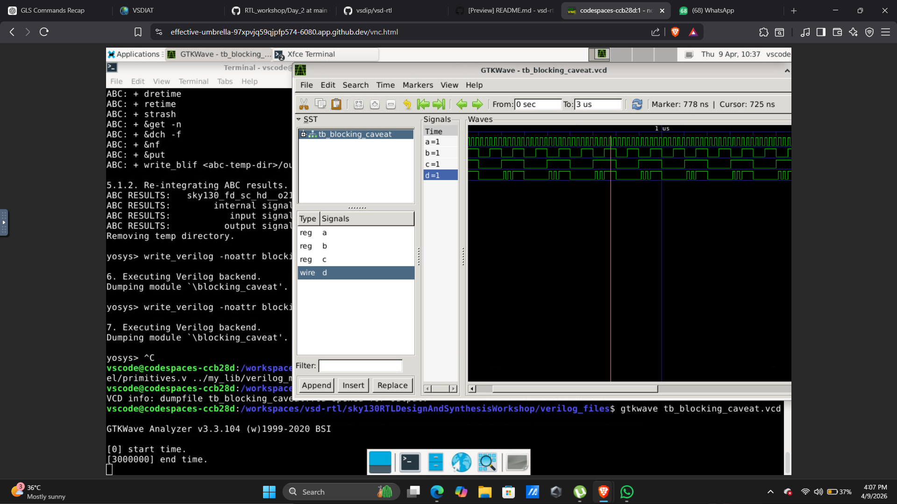

# DAY 4 – Blocking vs Non-Blocking, Bad MUX and GLS Verification

---

## 1. Introduction

Day 4 focuses on understanding important RTL coding concepts that directly affect how hardware is synthesized and simulated. Even if code looks correct in simulation, improper coding styles can lead to incorrect hardware behavior after synthesis.

This day mainly covers:

* Difference between blocking and non-blocking assignments
* Mismatch between simulation and synthesis
* Bad multiplexer coding styles
* Importance of Gate Level Simulation (GLS)

These concepts are critical because incorrect RTL coding can introduce functional bugs that are difficult to detect without proper verification.

---

## 2. Gate Level Simulation (GLS)

GLS is performed after synthesis using the generated netlist and standard cell libraries.

GLS uses:

* Synthesized netlist
* Standard cell libraries
* Same testbench

This step is critical for validating that the synthesized hardware behaves exactly as intended.

---

## 3. Ternary Operator MUX

### Description

The ternary operator is a compact way to describe a multiplexer in Verilog. It ensures clear combinational logic and avoids unintended latch inference.

---

### RTL Code

---

### Synthesis Output

---

### Simulation Output

---

### GLS Output

---

### Observation

* RTL simulation shows correct mux behavior based on select signal
* Synthesized netlist clearly maps to a 2:1 multiplexer structure
* GLS output matches RTL simulation, confirming correct hardware implementation
* No mismatch observed, indicating proper coding style

---

## 4. Bad MUX Design

### Description

Improper coding of a multiplexer can lead to unintended latches or incorrect synthesis results.

---

### Code

---

### Simulation

---

### GLS Output

---

### Observation

* RTL simulation may appear correct due to ideal behavioral modeling
* During synthesis, incomplete assignments lead to latch inference
* GLS output shows mismatch compared to RTL simulation
* This highlights that improper coding leads to incorrect hardware

---

## 5. Blocking Assignment Caveat

### Description

Blocking assignments (=) execute sequentially in simulation, which may not reflect actual hardware behavior.

---

### Code

---

### Simulation

---

### GLS Output

---

### Observation

* RTL simulation executes statements sequentially, giving expected results
* Synthesized hardware operates in parallel, not sequentially
* GLS output differs from RTL simulation
* This demonstrates why blocking assignments can cause functional mismatches

---

## 6. Key Learnings

* Understood difference between blocking and non-blocking assignments
* Learned how bad coding styles lead to latch inference
* Observed mismatch between RTL simulation and GLS
* Importance of GLS in verifying real hardware behavior
* Learned best practices for writing synthesizable RTL

---

## 7. Conclusion

Day 4 emphasized the importance of writing correct RTL code that matches hardware behavior. Through various examples, it was observed that improper coding styles can lead to mismatches between simulation and synthesized results. Gate Level Simulation plays a crucial role in identifying such issues and ensuring reliable hardware design.

---
