# 📅 Day 5 – RTL Design Mastery

---

## 🚀 Overview

On Day 5, I explored different coding styles in Verilog and how they impact **simulation vs synthesis behavior**.
This includes understanding **complete/incomplete case statements**, **if conditions**, and **MUX/DEMUX implementations**.

---

## 📚 Topics Covered

1. Gate-Level Simulation (GLS)
2. Synthesis vs Simulation Mismatch
3. Blocking vs Non-Blocking (conceptual understanding)
4. Case statements (complete & incomplete)
5. If conditions (complete & incomplete)
6. MUX and DEMUX design
7. Ripple Carry Adder (RCA)

---

## ⚠️ Synthesis vs Simulation Mismatch

* Occurs when RTL simulation output differs from synthesized hardware
* Mainly caused due to:

  * Incomplete case statements
  * Missing default conditions
  * Improper sensitivity lists

---

## 🔍 Experiments & Observations

---

### 1️⃣ Bad Case Example

* Missing default condition
* Leads to latch inference

📸 Screenshots:

* 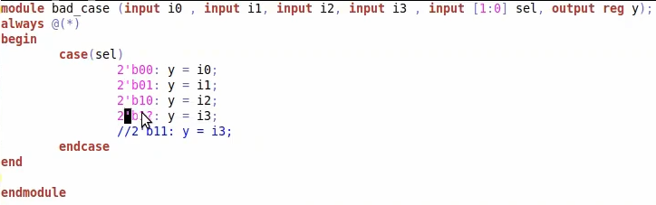
* 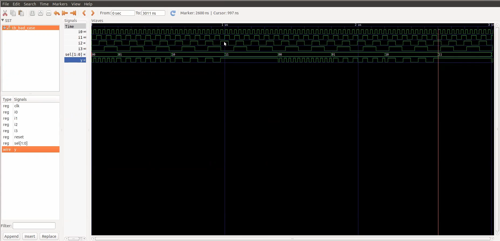

---

### 2️⃣ Complete Case

* Covers all input combinations
* No latch inferred

📸 Screenshots:

* 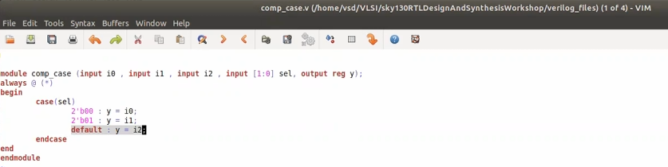
* 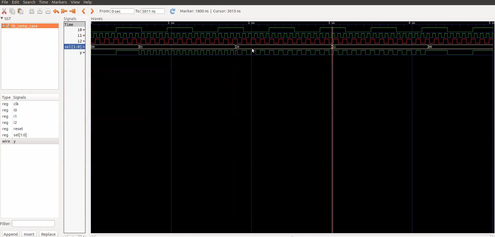
* 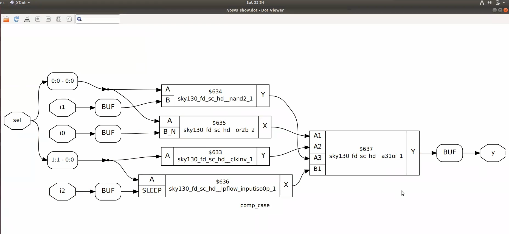

---

### 3️⃣ Incomplete Case

* Missing some input conditions
* Causes unintended latch

📸 Screenshots:

* 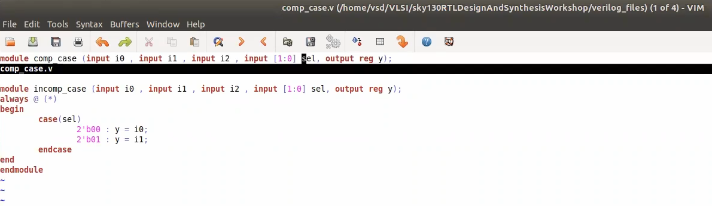
* 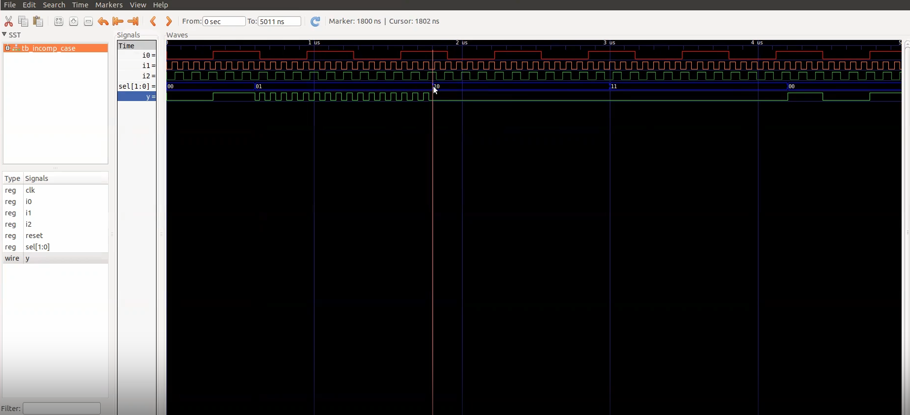
* 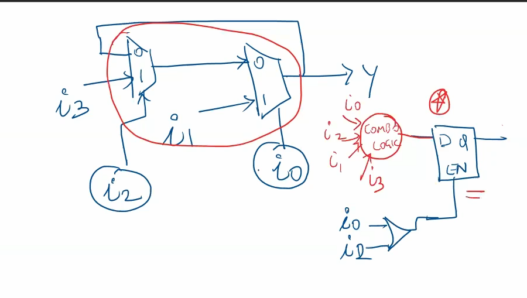

---

### 4️⃣ Incomplete IF Conditions

* Missing else condition
* Leads to latch behavior

📸 Screenshots:

* 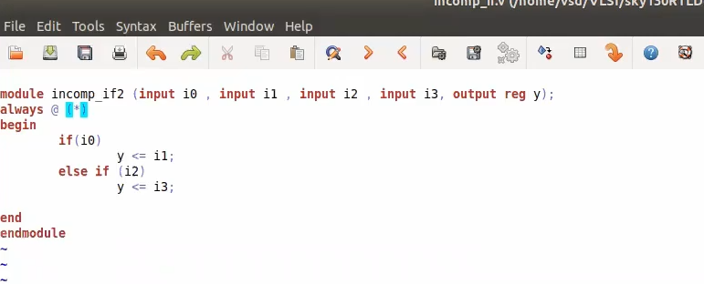
* 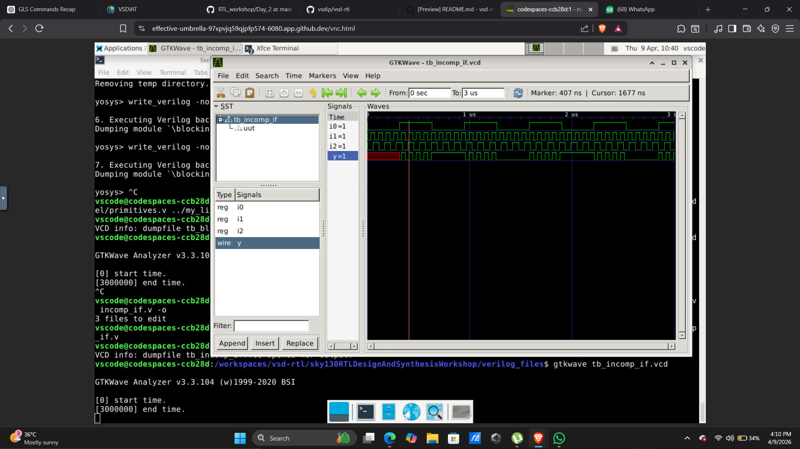

---

### 5️⃣ IF-ELSE Variations

📸 Screenshots:

* 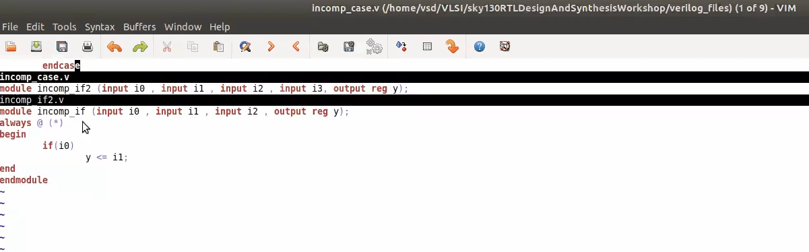
* 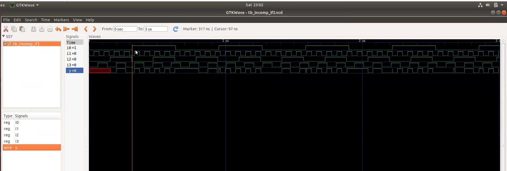
* 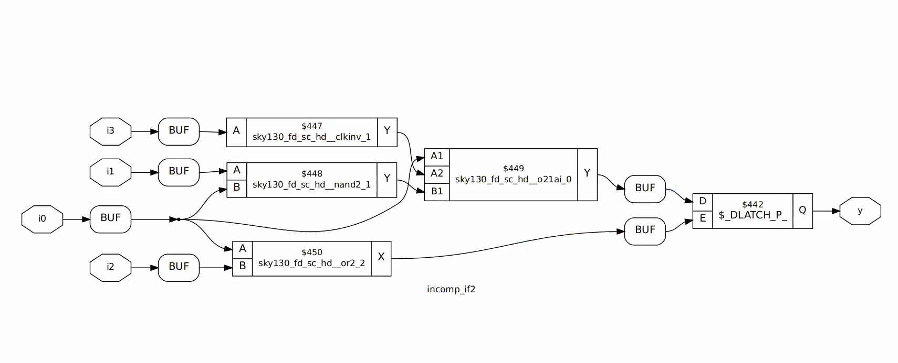

---

### 6️⃣ DEMUX Design

* Implemented using:

  * Case statements
  * Generate block

📸 Screenshots:

* 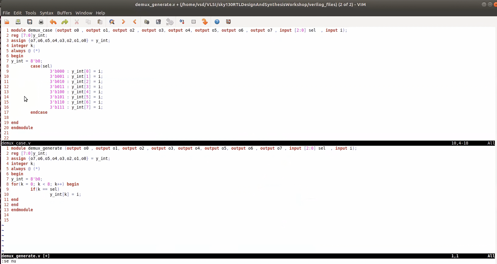
* 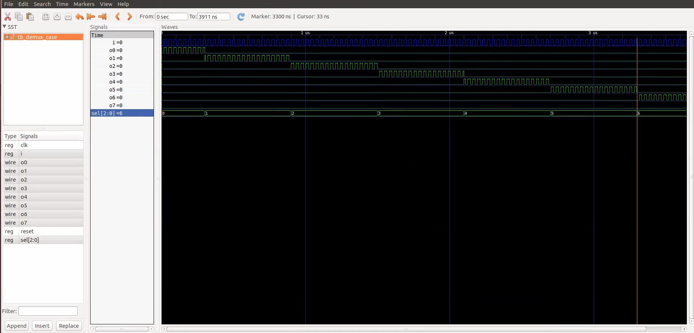
* 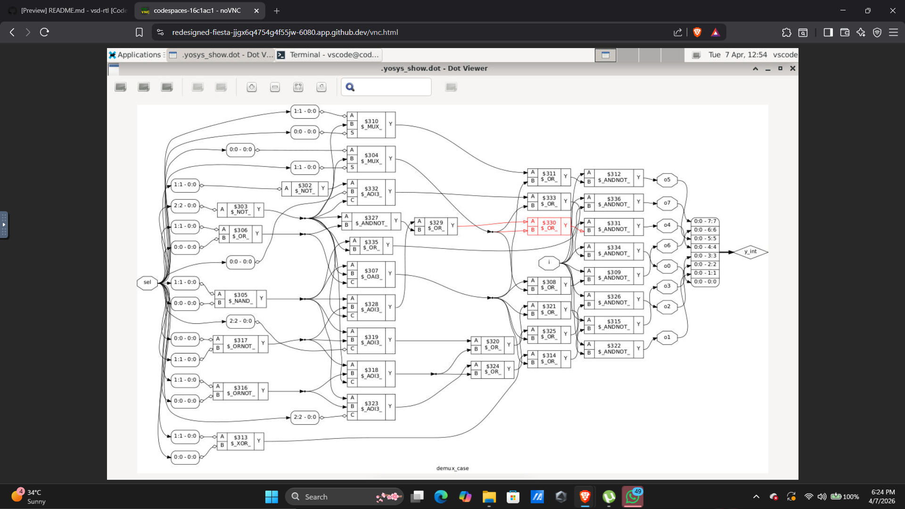
* 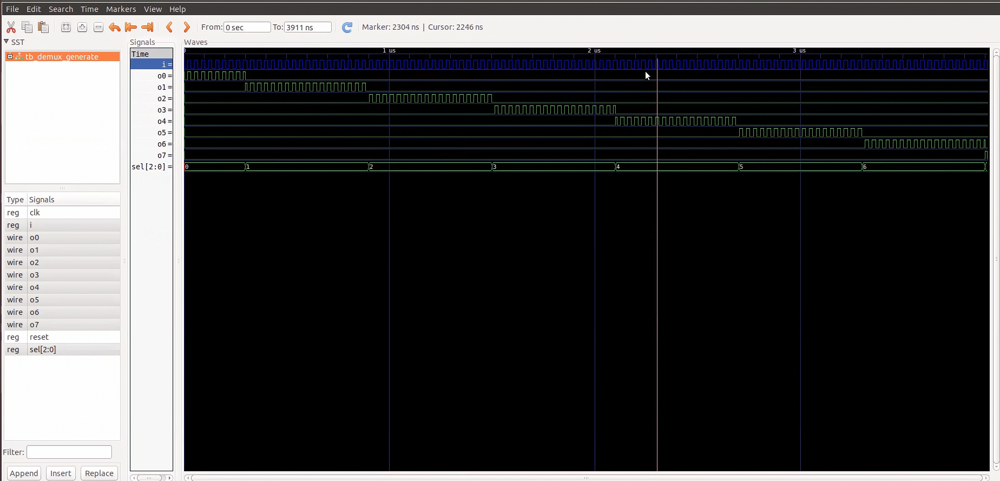
* 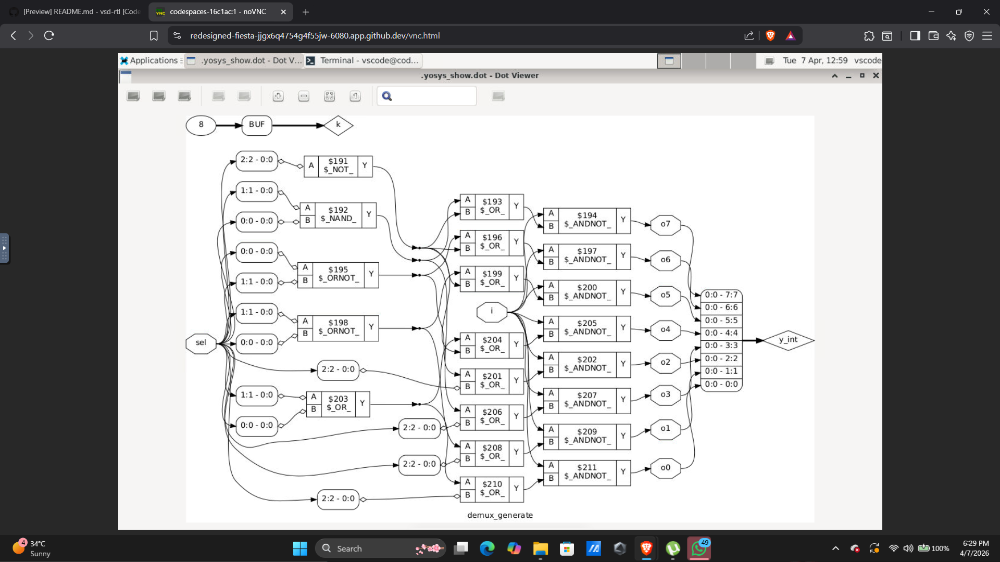

---

### 7️⃣ MUX Generator

📸 Screenshots:

* 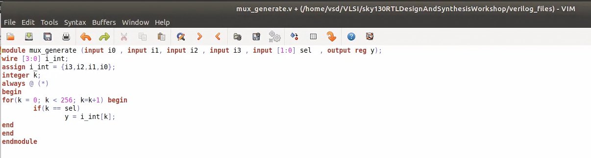
* 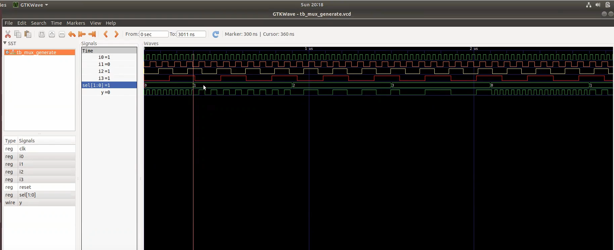

---

### 8️⃣ Partial Case Assign

📸 Screenshots:

* 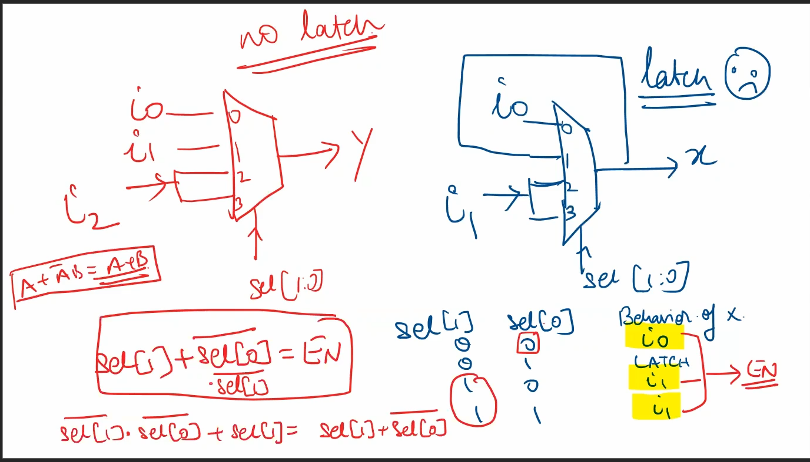
* 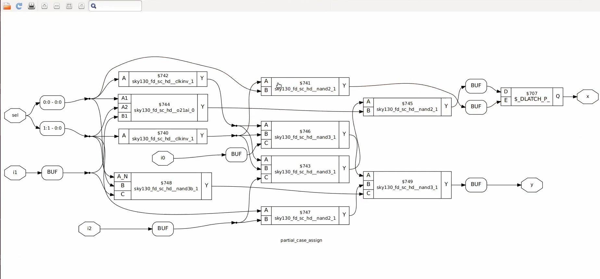

---

### 9️⃣ Ripple Carry Adder (RCA)

📸 Screenshots:

* 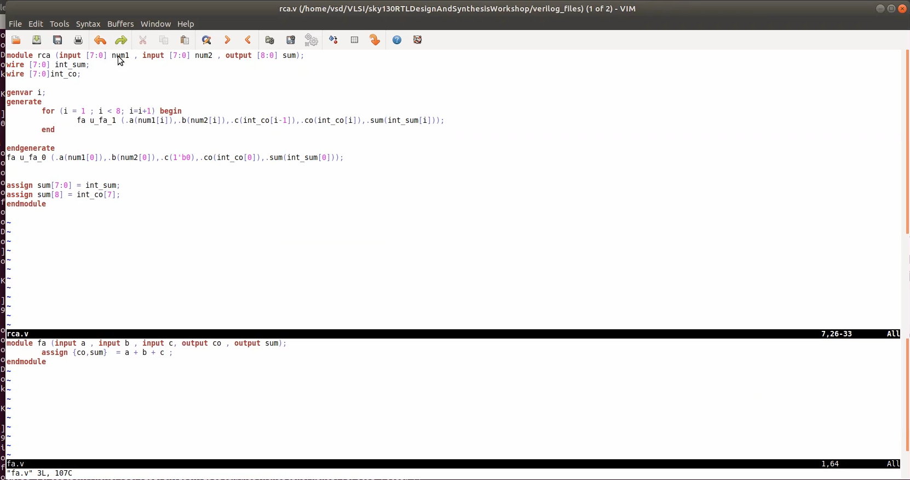
* 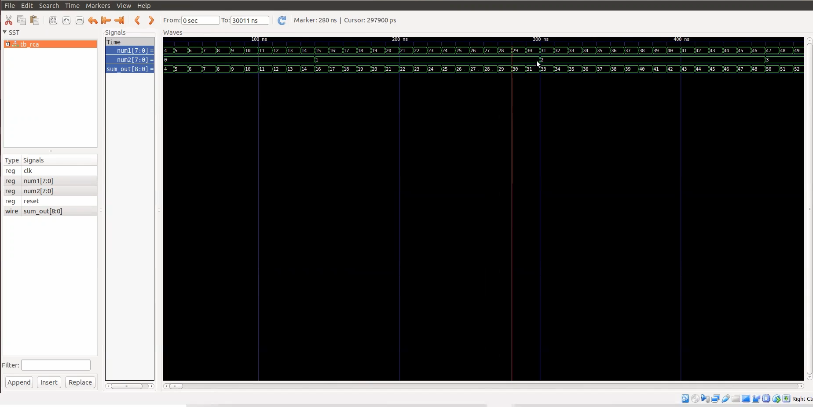

---

## 🧠 Key Learnings

* Always use **complete case statements**
* Add **default conditions** to avoid latches
* Incomplete IF or CASE → **Latch inference**
* Simulation may look correct but synthesis can differ
* Writing clean RTL ensures predictable hardware

---

## 🛠️ Tools Used

* VS Code
* Yosys (Synthesis)
* GTKWave (Simulation)

---

## 📌 Folder Structure

```
DAY5/
 ├── screenshots/
 └── README.md
```

---

## 🎯 Conclusion

Day 5 helped me understand how small mistakes in RTL coding can lead to major issues in hardware implementation.
Writing **synthesis-friendly code** is critical in VLSI design.

---
