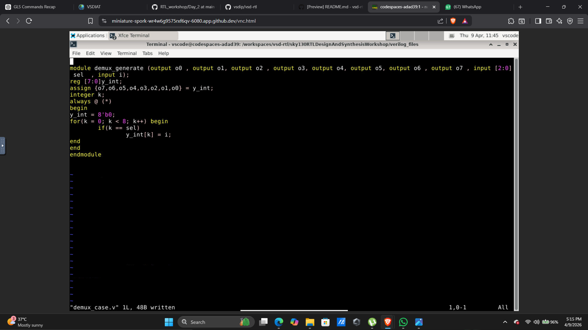
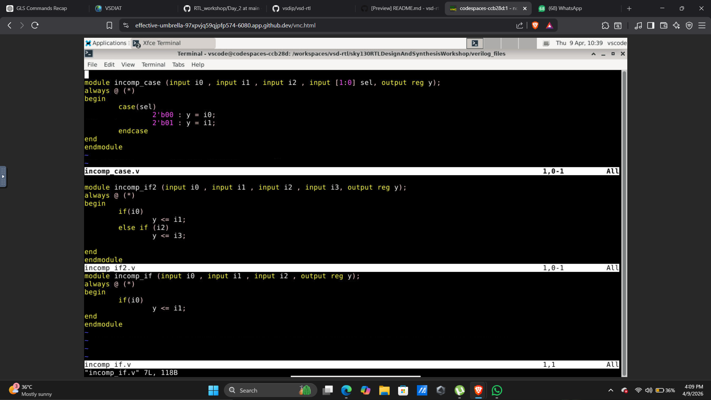
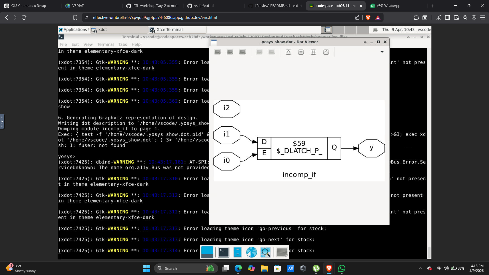
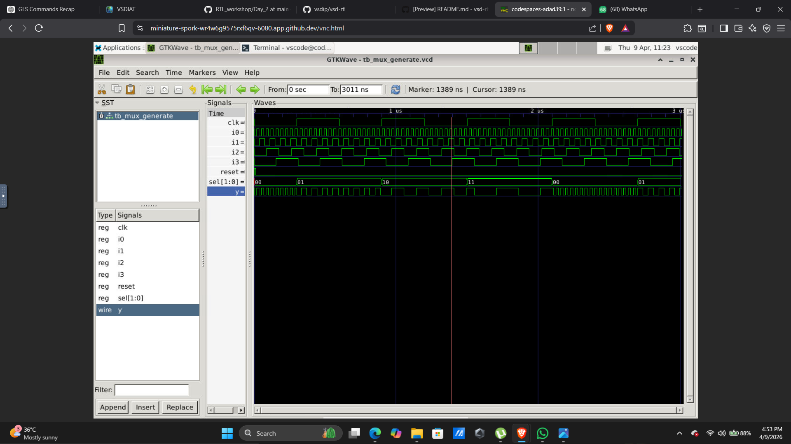
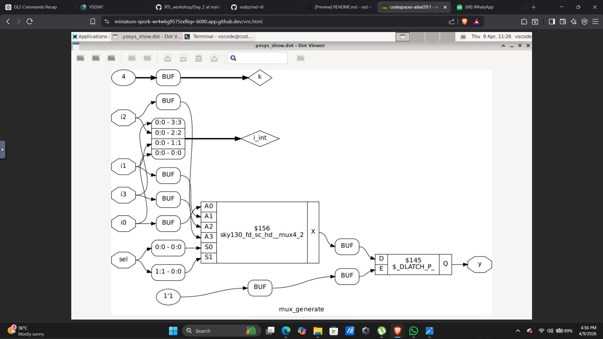
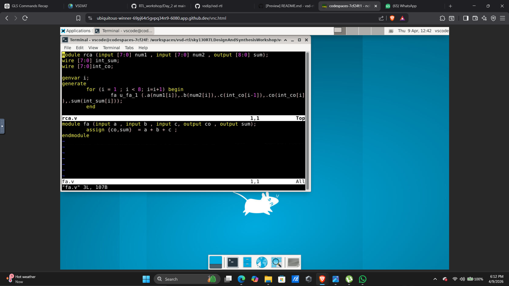
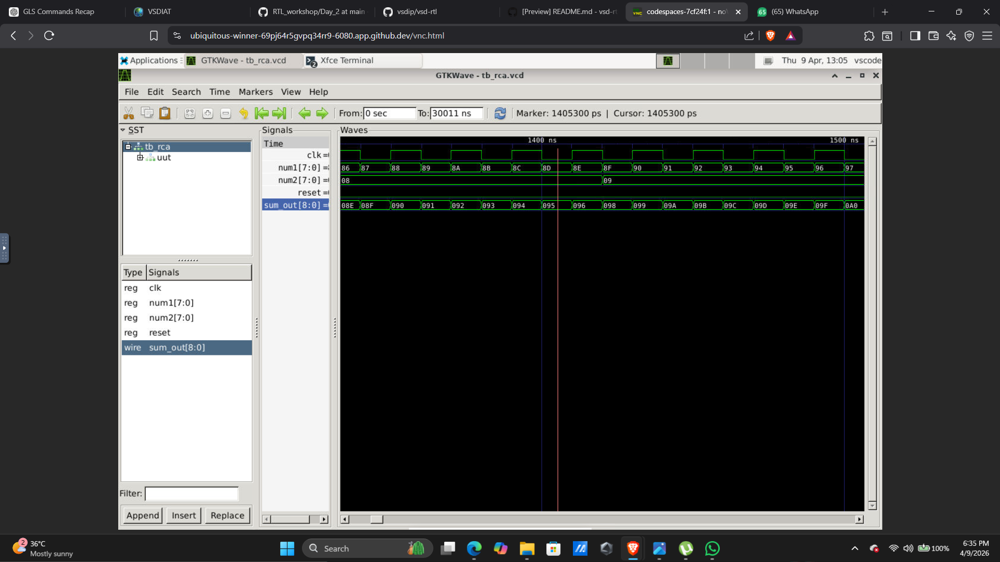

# DAY 5 – Generate Statements, Incomplete Constructs and Arithmetic Circuits

---

## 1. Introduction

Day 5 focuses on advanced RTL coding techniques and how synthesis tools interpret different coding styles. The experiments performed in this lab highlight how incorrect or incomplete coding can lead to unintended hardware such as latches, while structured coding using generate blocks improves scalability and design clarity.

This day mainly covers:

* Generate statements for scalable hardware design
* Behavior of incomplete if and case statements
* Latch inference due to missing assignments
* Design and verification of arithmetic circuits like Ripple Carry Adder (RCA)
* Comparison between RTL simulation, synthesis, and GLS

Understanding these concepts is critical for writing robust and synthesizable RTL code.

---

## 2. Generate Statement – Demultiplexer

### Description

Generate blocks are used to create multiple instances of hardware efficiently. In this experiment, a demultiplexer is implemented using generate constructs.

---

### Code

---

### Simulation

---

### Synthesis

---

### GLS Output

---

### Observation

* Generate block expands into multiple hardware instances during synthesis
* RTL simulation shows correct demultiplexing behavior
* Synthesized netlist reflects parallel hardware structure
* GLS output matches RTL, confirming correct implementation
* Demonstrates scalability and clean hardware generation

---

## 3. Case-Based Demultiplexer

### Description

A demultiplexer is implemented using case statements to observe how synthesis interprets conditional constructs.

---

### Simulation

---

### Synthesis

---

### Observation

* Case statement correctly selects output line based on input
* Synthesized hardware behaves as expected when all cases are defined
* No latch inference observed due to complete case coverage

---

## 4. Incomplete Case Statement

### Description

Incomplete case statements can lead to unintended latch inference because not all input conditions are covered.

---

### Code

---

### Simulation

---

### Synthesis

---

### Observation

* RTL simulation may not clearly show issues
* Synthesis infers latches to preserve previous values
* Hardware becomes sequential instead of purely combinational
* Demonstrates importance of covering all cases

---

## 5. Incomplete If Statements

### Description

Missing else conditions in if statements can also lead to latch inference.

---

### Simulation (Case 1)

---

### Synthesis (Case 1)

---

### Simulation (Case 2)

---

### Observation

* Missing else condition causes output to retain previous value
* Synthesizer introduces latches to maintain state
* RTL and synthesized behavior may differ
* Highlights need for complete conditional assignments

---

## 6. Generate-Based MUX

### Description

Multiplexer design using generate blocks to build scalable structures.

---

### Simulation

---

### Synthesis

---

### GLS Output

---

### Observation

* Generate constructs create structured multiplexer hierarchy
* Synthesized hardware shows repeated patterns
* GLS output matches RTL behavior
* Confirms correctness of scalable design

---

## 7. Ripple Carry Adder (RCA)

### Description

Ripple Carry Adder is a basic arithmetic circuit where carry propagates from one stage to the next.

---

### Code

---

### Simulation

---

### GLS Output

---

### Observation

* Sum and carry propagate sequentially through stages
* RTL simulation shows correct addition behavior
* GLS confirms accurate gate-level implementation
* Demonstrates delay due to carry propagation

---

## 8. Key Learnings

* Learned usage of generate statements for scalable design
* Understood latch inference due to incomplete coding
* Observed differences between combinational and sequential behavior
* Learned importance of complete case and if statements
* Verified designs using GLS for real hardware validation

---

## 9. Conclusion

Day 5 provided deep insights into RTL coding practices and their impact on synthesis. It highlighted the importance of writing complete and structured code to avoid unintended hardware. Generate constructs proved useful for scalable designs, while GLS helped validate the correctness of synthesized circuits.

---
